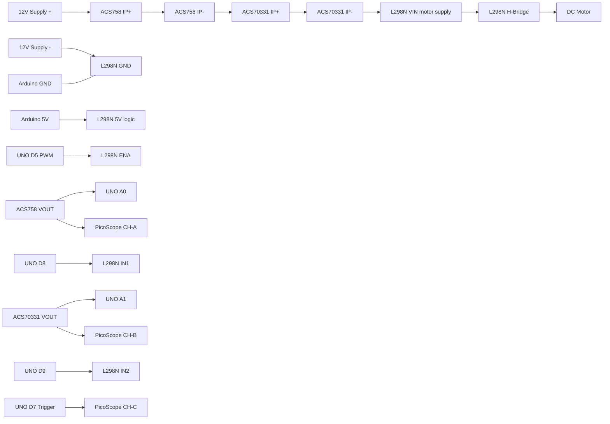

# Wiring Schematic (Bench A/B Sensor Test)

This schematic is for comparing `ACS758` and `ACS70331` on the same motor-drive experiment using Arduino UNO + L298N + PicoScope.

## 1) Recommended Topology
Use both current sensors in series on the motor power rail to expose both to the same current profile.

## 2) Pin Map
### Arduino UNO -> L298N
- `D5` -> `ENA` (PWM)
- `D8` -> `IN1`
- `D9` -> `IN2`
- `5V` -> `5V` (logic rail; if your L298N module jumper/power config requires it)
- `GND` -> `GND`

### Arduino UNO -> Sensors
- `A0` <- `ACS758 VOUT`
- `A1` <- `ACS70331 VOUT`
- `D7` -> scope trigger output
- `GND` common with both sensor grounds

### Sensor power
- `ACS758`: typically `5V` supply (check your module)
- `ACS70331`: supply per your module/variant requirement (many boards are 3.3V domain)

## 3) PicoScope Connections
- CH-A: `ACS758 VOUT`
- CH-B: `ACS70331 VOUT`
- CH-C: `Arduino D7` trigger
- CH-D (optional): reference current channel (shunt amplifier output)
- Scope ground clips to common bench ground

## 4) Optional Absolute-Accuracy Path
If you want gain/linearity error (not only relative comparison), add:
- low-side shunt resistor in L298N return path
- differential measurement (probe or amplifier)
- route amplified shunt signal to scope CH-D (and optional UNO A2)

## 5) Build Notes
- Keep motor wiring twisted and away from sensor analog lines.
- Keep sensor output wires short.
- Add decoupling near sensor VCC pins (`0.1uF` + bulk cap if needed).
- Start with low duty cycle and verify direction/waveform before long runs.
- Do not exceed ACS70331 range during stall events.

## 6) Grounding Caution
If Arduino is USB-connected to a grounded PC and scope ground is also earth-referenced, avoid creating unintended ground loops around any low-side shunt path. Use a single ground reference strategy and verify before power-on.
