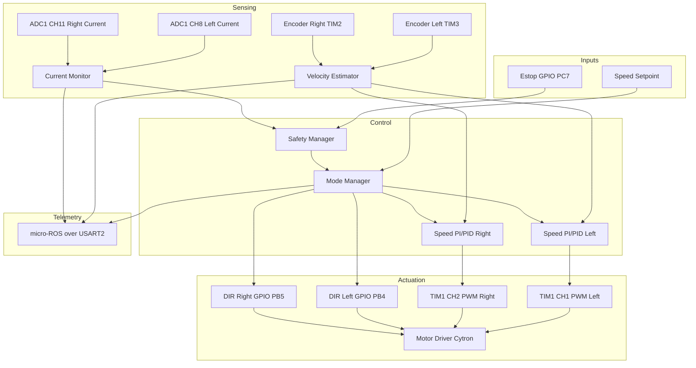
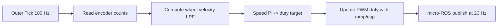
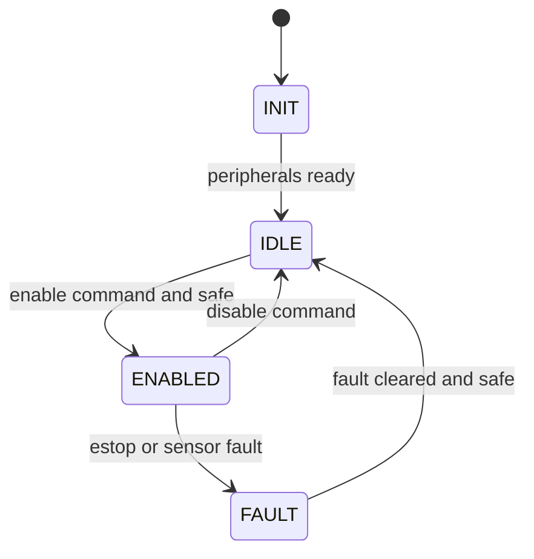
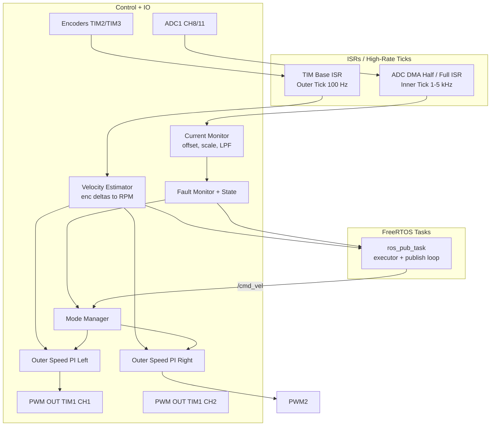

# STM32 Architecture (Firmware + micro-ROS)

Owner: Kartik Mehta  
Status: In progress - dual-motor speed PI with ramp; current used for protection; micro-ROS client active on USART2 with /cmd_vel sub and RPM/fault publishers.  
Last Updated: 2025-12-22

## Current Implementation Snapshot
- Control loop: TIM4 at 100 Hz; speed PI per wheel; duty ramp; differential-drive mapping; cmd_vel staleness timeout (500 ms).
- Sensing: encoders TIM3 (left, 16-bit) / TIM2 (right, 32-bit) with RPM LPF; ADC1 CH8/11 current sense (ACS758) with scaling and LPF.
- Faults: overcurrent, stall, encoder timeout, ADC stuck detection; fault mask latched in ControlState.
- micro-ROS: USART2 custom transport; /cmd_vel sub (reliable); /amr/wheel_rpm_left, /amr/wheel_rpm_right, /amr/fault_mask pubs (best effort) at 20 Hz.
- PWM/Dir: TIM1 CH1/CH2 at 20 kHz; DIR PB4/PB5; duty capped at 30%.
- Legacy UART telemetry: disabled to avoid contention with micro-ROS on USART2.

## Goals
- Deterministic control on STM32: dual-wheel speed PI (single-loop) with smooth ramps.
- Current sensing used for protection/diagnostics (not in the control loop).
- micro-ROS interface for wheel commands (Twist/cmd_vel), enable/estop/clear, and telemetry.
- Safety gating and fault latching.

## Peripherals and IO
- PWM: TIM1 CH1/CH2 at 20 kHz (PA8/PA9).
- DIR GPIO: PB4/PB5.
- Encoders: TIM3 (left PA6/PA7), TIM2 (right PA0/PA1).
- ADC: ADC1 CH8 (PB0), CH11 (PC1) for ACS758 current.
- UART: USART2 460800 bps for micro-ROS custom transport.
- E-stop sense: PC7 (active low, pull-up).

## Parameters (current values in app_config.h)
- Geometry: TRACK_WIDTH_M=0.386, WHEEL_RADIUS_M=0.0615.
- Control loop: CONTROL_LOOP_HZ=100; CMD_TIMEOUT_MS=500.
- Duty limits: MOTOR_DUTY_MAX=0.30; DUTY_RAMP_RATE_PER_SEC=0.2.
- Command ramping: V_CMD_RAMP_RATE_MPS=0.20, W_CMD_RAMP_RATE_RAD=0.80.
- RPM filtering: RPM_LPF_ALPHA=0.85; RPM_SPIKE_LIMIT_RPM=500.
- Speed PI: KP/KI per wheel; output clamped to +/-0.30; I clamped to +/-0.20.
- Current sense: divider ratio 0.667; LPF alpha 0.1; zero tracking enabled.
- Fault thresholds:
  - OC: 1500 mA with 50 ms dwell.
  - Stall: duty >= 8% and |RPM| <= 0.5 for 500 ms.
  - Encoder timeout: cmd RPM >= 0.5 and measured ~0 for 1000 ms.
  - ADC stuck: 30 samples at rail or identical values (when |duty| >= 2%).

## Loop Rates and Ownership
- Inner/current tick: reserved (1-5 kHz) tied to PWM/ADC (deferred until higher-accuracy sensor).
- Outer/speed loop: 100 Hz via TIM4. Computes RPM, runs speed PI, updates duty targets.
- micro-ROS publish: 20 Hz (osDelay 50 ms in ros_pub_task).
- ISRs/ticks own control math; RTOS tasks move messages/buffers.

## Data Flow (single-loop)
1) Receive /cmd_vel via micro-ROS; store latest with timestamp.
2) Outer tick: read cmd, map v/w to left/right RPM targets, clamp, apply ramp, run speed PI -> duty targets.
3) Apply duty via TIM1 CH1/CH2 (DIR set per polarity).
4) Sense: encoder deltas -> RPM (LPF); currents -> filtered for protection.
5) Fault monitor computes fault_bits; ControlState latches faults.
6) micro-ROS publishes wheel RPM and fault mask.

## Motor Control Diagrams

## micro-ROS Integration Architecture

Current topics
- Sub: /cmd_vel (geometry_msgs/Twist) reliable.
- Pub: /amr/wheel_rpm_left, /amr/wheel_rpm_right (std_msgs/Int32, RPM x10) best effort.
- Pub: /amr/fault_mask (std_msgs/Int32) best effort.

Planned topics
- Sub: /amr/estop, /amr/enable, /amr/clear_fault (Bool/Empty or service).
- Pub: /amr/wheel_state (JointState or custom), /amr/safety_state (state + fault mask).

## Fault Mask (current bits)
- Bit 0: CTRL_FAULT_ESTOP
- Bit 1: CTRL_FAULT_OC_LEFT
- Bit 2: CTRL_FAULT_OC_RIGHT
- Bit 3: CTRL_FAULT_STALL_LEFT
- Bit 4: CTRL_FAULT_STALL_RIGHT
- Bit 5: CTRL_FAULT_ENC_TIMEOUT_LEFT
- Bit 6: CTRL_FAULT_ENC_TIMEOUT_RIGHT
- Bit 7: CTRL_FAULT_ADC_STUCK
- Bit 15: CTRL_FAULT_GENERIC

## Implementation Mapping
- Control loop + tasks: `STM_Firmware_AMR_v2/Core/Src/main.c` (control_task at 100 Hz, ros_pub_task executor + publish).
- Control law + ramps: `STM_Firmware_AMR_v2/Core/Src/control_loop.c`.
- Fault detection: `STM_Firmware_AMR_v2/Core/Src/fault_monitor.c`.
- State machine and fault latch: `STM_Firmware_AMR_v2/Core/Src/control_state.c`.
- Current sensing: `STM_Firmware_AMR_v2/Core/Src/current_sense.c`.

## Known Gaps
- estop/enable/clear_fault not wired into ControlInputs yet (enable_cmd forced true).
- wheel_state and safety_state topics not yet implemented.
- voltage faults pending ADC/BMS integration.

## Next Steps
- Wire estop/enable/clear commands into ControlState and add micro-ROS topics.
- Publish wheel_state and safety_state; document topic contracts and units.
- Finalize fault mask documentation and add voltage faults when available.
- Optional: per-wheel feedforward to reduce duty skew; finalize PI gains and log overshoot with python_scripts/check_overshoot.py.
- Defer cascaded current control unless needed; keep current for protection/logging.
