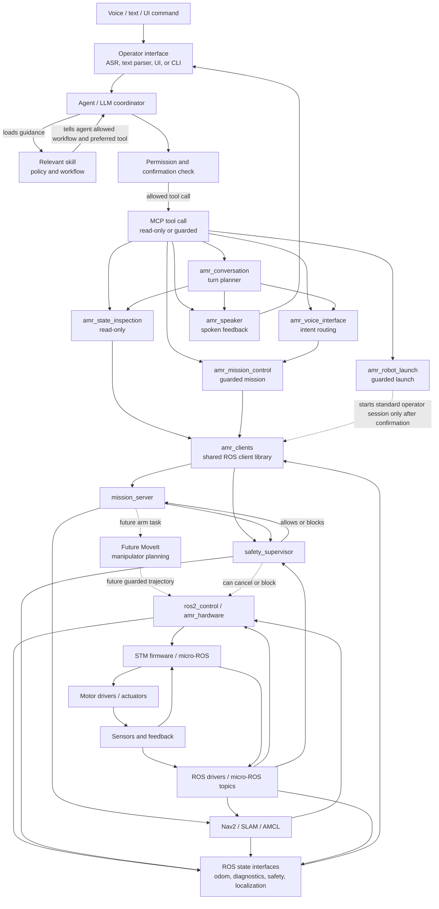
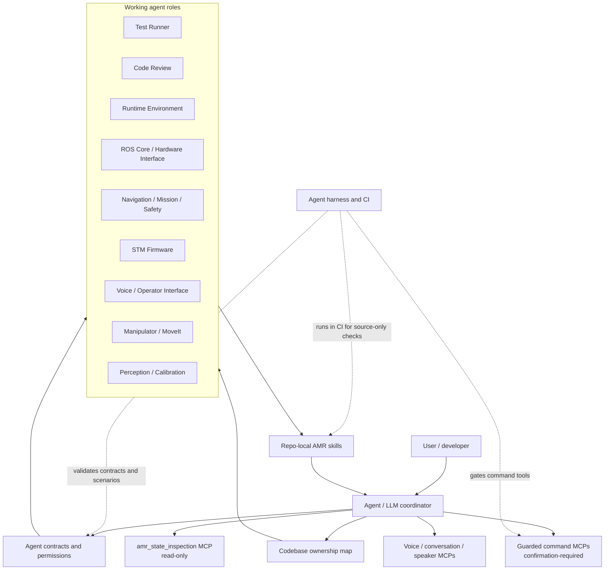

# Agentic Behavior Diagram

This page shows how the AMR agent layer is intended to behave during development, validation, and future robot operation. It is the agentic counterpart to `docs/architecture/00_system_hierarchy.md`.

The key rule is that agents, skills, and MCP servers sit above the deterministic robot stack. They may inspect, plan, validate, and request typed actions, but they must not bypass mission, safety, ROS control, or STM firmware boundaries.

## Runtime Command Flow

This is the main operating path for a voice, text, or UI command. The skill guides the agent; the agent calls an MCP tool; the MCP tool calls a shared ROS client or ROS-facing node; the ROS stack and firmware decide and execute.



## How To Read This Diagram

- The skill does not directly command the MCP server.
- The skill tells the agent how the task should be completed: which checks matter, which actions are blocked, and which MCP tool is preferred.
- The agent decides whether it is allowed to call an MCP tool.
- The MCP tool is the callable API surface. State-inspection is read-only; mission-control and robot-launch are guarded and confirmation-required where they can change robot state.
- MCP servers should call shared ROS clients or ROS-facing nodes rather than duplicate mission or safety logic.
- ROS clients call existing ROS services, actions, and topics.
- `amr_clients` is a consumer of ROS state; it is not a low-level sensor ingestion layer.
- Mission, safety, Nav2, MoveIt, `ros2_control`, and STM firmware remain the deterministic control path.
- Sensors and STM/ROS diagnostics feed state back through STM firmware, ROS drivers, `amr_hardware`, localization, safety, and diagnostics before `amr_clients` reads or summarizes it for MCP/agent use.

## Development And Support Structure

This second diagram shows the support pieces around the runtime path. These are mostly used during development, review, validation, bring-up, and safe operation planning.



In short:

```text
Skill = policy and procedure for the agent
Agent = decision maker and MCP tool caller
MCP = callable tool/API boundary
ROS client = implementation adapter into ROS
ROS + firmware = real robot authority
```

## Current And Future Boundaries

Current implemented read-only and voice/status paths:

```text
User request
  -> Codex
  -> agent contract + skill
  -> source-only harness, voice/conversation/speaker MCPs, or read-only MCP state inspection
  -> shared ROS clients
  -> existing ROS state interfaces
```

Current guarded command path:

```text
User request
  -> Codex
  -> agent contract + skill
  -> permission check + explicit confirmation
  -> guarded mission-control or robot-launch MCP
  -> shared ROS client
  -> mission server / safety supervisor
  -> Nav2 / MoveIt / ros2_control
  -> STM firmware
```

Blocked path:

```text
Agent / MCP / skill
  -> raw motor PWM, raw unsafe /cmd_vel motion, disabled safety, unguarded joint motion
```

## Ownership

- Primary owner: Code Review Agent.
- Secondary owner: Test Runner Agent.
- Domain agents own the parts of the diagram that describe their contracts, skills, and runtime boundaries.
- Permission behavior remains defined in `docs/agentic/agent_tool_permissions.md`.
- Repo routing remains defined in `docs/agentic/codebase_ownership.md`.
