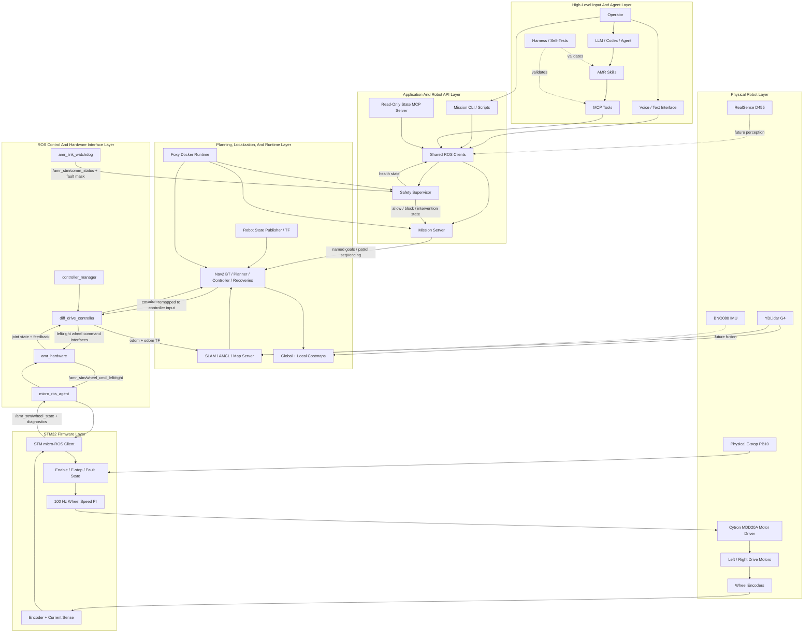

# AMR System Hierarchy Diagram

This is the top-level communication hierarchy for the AMR project. It shows how high-level operator or agent input flows down to robot motion, and how sensor/diagnostic feedback flows back up.

The LLM/agent layer does not directly command motors. It can call bounded tools, such as MCP tools or CLI workflows, which then pass through ROS clients, mission/safety logic, Nav2, `ros2_control`, the STM32 firmware, and finally the motor driver.

## Detailed Diagram Inventory

Detailed architecture and hardware diagram sources that existed before the agent-owned entry-point split:

| Document | Scope | Mermaid diagrams |
| --- | --- | --- |
| `docs/architecture/ros_stack_diagrams.md` | ROS graph, TF, mapping, localization, navigation, mission layer, topic ownership | 6 |
| `docs/architecture/STM_architecture.md` | STM32 firmware, micro-ROS, control loop, fault states | 4 |
| `docs/hardware/hardware_block_diagram.md` | Power, compute, sensors, drive hardware | 1 |
| `docs/hardware/wiring_schematic.md` | Wiring and signal-level hardware details | 2 |

Total detailed Mermaid diagrams in those source documents: 13.

## High-Level Input-To-Actuator And Sensor Feedback Path

## Block-Level Architecture Documents

| Block | Current or planned detail diagram |
| --- | --- |
| Agent, skills, MCP, harness | `docs/agentic/agentic_behavior_diagram.md`, `docs/agentic/agentic_robotics_roadmap.md`, `docs/agentic/agent_tool_permissions.md` |
| Runtime / Docker / Jetson | `docs/architecture/10_runtime_environment.md` |
| ROS core hardware interface | `docs/architecture/20_ros_core_hardware_interface.md` |
| Navigation / mission / safety | `docs/architecture/30_navigation_mission_safety.md` |
| STM32 firmware and micro-ROS | `docs/architecture/40_stm_firmware.md` |
| Voice / operator interface | `docs/architecture/50_voice_operator_interface.md` |
| Manipulator / MoveIt | `docs/architecture/60_manipulator_moveit.md` |
| Perception / calibration | `docs/architecture/70_perception_calibration.md` |
| Physical power, drive, sensors, wiring | `docs/architecture/80_physical_hardware.md` |

## Diagram Ownership Rule

Each major block should eventually have its own focused architecture diagram. The top-level hierarchy should stay stable and show boundaries; block-level diagrams should carry implementation details such as exact topics, services, frames, pins, launch files, devices, and safety checks.
