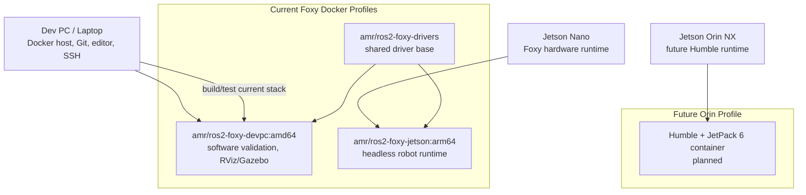

# Runtime Environment Architecture

Owner: Runtime Environment Agent  
Secondary: ROS Core / Hardware Interface Agent  
Status: Active

This block owns how the AMR software is built and run across the dev PC, Jetson Nano, and upcoming Jetson Orin NX.

## Responsibility

- Keep AMR ROS execution containerized.
- Treat Foxy Docker as the authoritative current Nano/dev PC workflow.
- Treat host ROS on the dev PC as non-authoritative unless explicitly requested.
- Keep Orin NX migration as a separate Humble Docker profile, not a silent replacement for Nano/Foxy.
- Maintain Dockerfiles, runtime scripts, device-mount policy, and runtime environment docs.

## Runtime Block Diagram

## Detailed Sources

- `docker/foxy/README.md`
- `docs/architecture/jetson_architecture.md`
- `docs/architecture/jetson_orin_nx_device_profile.md`
- `docs/agentic/roles/runtime_environment_agent.md`

## Validation

- Source-only harness checks may run in CI.
- Current AMR ROS build validation should run inside `amr/ros2-foxy-devpc:amd64`.
- Hardware-facing containers with device mounts, host networking, or privileged access require explicit supervised confirmation.
