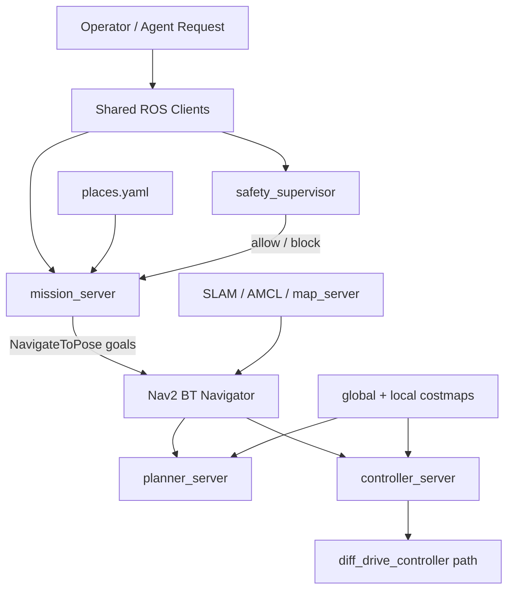

# Navigation, Mission, And Safety Architecture

Owner: Navigation / Mission / Safety Agent  
Secondary: ROS Core / Hardware Interface Agent  
Status: Active

This block owns navigation behavior above the core hardware interface.

## Responsibility

- SLAM, AMCL, Nav2 planning/control/recoveries, maps, and named places.
- Mission server and mission CLI behavior.
- Safety supervisor state, motion denial logic, and recovery procedures.
- Readiness checks for localization, safety, mission, and navigation.

## Navigation And Mission Diagram

## Detailed Sources

- `docs/architecture/ros_stack_diagrams.md`
- `docs/safety/safety_baseline.md`
- `docs/safety/safety_fault_recovery.md`
- `ros_ws/src/amr_missions`
- `ros_ws/src/amr_safety`
- `ros_ws/src/amr_description/config/nav2_params_amr.yaml`
- `ros_ws/src/amr_missions/config/places.yaml`

## Current Detailed Diagrams Owned Here

- Mapping mode with SLAM Toolbox.
- Localization and navigation mode.
- Mission layer over Nav2.

## Validation

- Software-only parser/config/unit tests when available.
- Foxy Docker build/test for affected packages.
- Simulation only when explicitly requested.
- Physical navigation or recovery only with supervised hardware confirmation.
