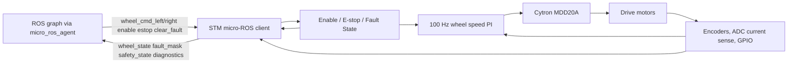

# STM Firmware Architecture

Owner: STM Firmware Agent  
Secondary: ROS Core / Hardware Interface Agent  
Status: Active

This page is the agent-owned entry point for STM32 firmware architecture. The detailed source of truth remains `docs/architecture/STM_architecture.md`.

## Responsibility

- STM32 motor-control loop and fault state.
- micro-ROS topic contract under `/amr_stm`.
- Encoder and current sensing.
- E-stop PB10 behavior.
- Fault masks, safety state, enable, clear-fault behavior, and diagnostic publishing.

## Firmware Boundary Diagram

## Detailed Sources

- `docs/architecture/STM_architecture.md`
- `docs/hardware/pin_map.yaml`
- `STM/STM_Firmware_AMR_v2`
- `docs/hardware/wiring_schematic.md`

## Current Detailed Diagrams Owned Here

- STM motor control diagrams.
- Firmware control-loop flow.
- Firmware state diagram.
- micro-ROS integration architecture.

## Validation

- Firmware compile once the exact non-flashing command is documented.
- Static inspection for topic names, PB10 E-stop, fault masks, and app config values.
- No flashing, STM reset, fault clear, enable, or motor tests without explicit supervised confirmation.
