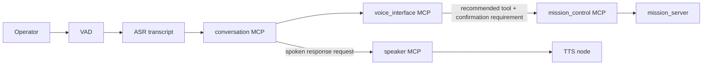
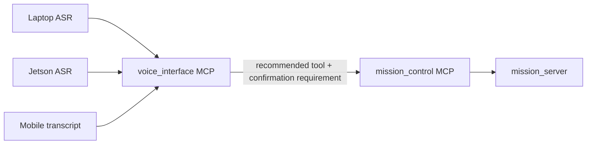

# Voice And Operator Interface Architecture

Owner: Voice / Operator Interface Agent  
Secondary: Navigation / Mission / Safety Agent  
Status: Active, early

This block owns operator-facing wake, transcript, intent parsing, and spoken
feedback for MCP-based mission/status requests.

## Responsibility

- Wake-word detection.
- Transcript command parsing.
- Confirmation before motion-causing intents.
- User feedback for accepted, denied, failed, or unavailable commands.
- Returning recommended MCP tool calls rather than directly calling mission services.
- Spoken feedback through a TTS node and speaker MCP, without making TTS a
  decision-making or motion-command layer.

## Operator Interface Diagram

## Detailed Sources

- `ros_ws/src/amr_voice`
- `mcp_servers/amr_voice_interface`
- `mcp_servers/amr_conversation`
- `mcp_servers/amr_speaker`
- `ros_ws/src/amr_clients`
- `docs/agentic/roles/voice_operator_interface_agent.md`

## MCP Boundary

The voice MCP is input-agnostic. Laptop, Jetson, or mobile audio paths should produce
plain text transcripts and submit them to `mcp_servers/amr_voice_interface`. The MCP
parses the transcript, reports whether confirmation is required, and returns the
recommended next MCP tool. It does not start ASR, command motion, call Nav2 directly,
publish `/cmd_vel`, clear faults, or bypass mission-control readiness checks.

This keeps device-specific audio capture separate from robot command semantics:

## Wake-Word Stage

The first wake-word implementation uses `openWakeWord` with the built-in
`hey_jarvis` model as the default (`AMR_WAKE_MODEL=hey_jarvis`). This is a practical
starter model because it is open source, runs locally, and is small enough for laptop
and Jetson-class hardware. Live audio and new MCP transcript parsing use `hey jarvis`
until a custom AMR wake model is trained.

`ros_ws/src/amr_voice/amr_voice/wake_word_node.py` listens to a microphone and publishes
JSON wake events on `/amr_voice/wake_word`. It does not command motion or call mission
services.

`ros_ws/src/amr_voice/amr_voice/vad_node.py` uses Silero VAD through `openwakeword.vad`
and publishes JSON speech boundary events on `/amr_voice/vad`. It does not parse
commands, submit transcripts, command motion, or call mission services. Later ASR and
TTS stages should subscribe to wake/VAD events or share the same audio device pipeline,
then submit transcripts to the voice MCP.

`ros_ws/src/amr_voice/amr_voice/asr_file_cli.py` is the initial `whisper.cpp`
transcript-producer boundary. It accepts a WAV file, emits plain transcript text plus
the MCP argument payload, and does not call mission services.

## Spoken Feedback Stage

`ros_ws/src/amr_voice/amr_voice/tts_node.py` subscribes to `/amr_voice/say` for
LLM/operator responses and can also subscribe to `/amr_voice/feedback` for concise
pipeline feedback. It uses Piper as the local TTS engine and refuses playback when
the Piper binary, model, or audio output is unavailable.

`mcp_servers/amr_speaker` exposes `speak_text`, `get_speaker_status`, and
`describe_speaker_contract`. The MCP publishes speech requests to `/amr_voice/say`;
it does not synthesize audio, command motion, clear faults, or decide what failed.

For debug requests such as `debug what failed`, the voice MCP returns a read-only
`amr_state_inspection` tool plan. The LLM should call those inspection tools,
summarize the result, then optionally call `amr_speaker.speak_text` with the
summary.

## Conversation Stage

`mcp_servers/amr_conversation` plans one conversational turn from typed text or an
ASR transcript. It returns a short `assistant_response`, optional speaker MCP
request, and optional mission/state MCP plan. It is intentionally stateless for now:
callers may carry session history later, but robot facts must still come from
read-only state MCP tools and motion requests must still pass mission-control
confirmation gates.

## Removed Legacy Path

The old `voice_text_cli`, `voice_command_node`, and `voice_asr_node` nodes directly
called AMR mission ROS services. They have been removed from the MCP integration
branch so the new voice work cannot accidentally bypass the voice MCP and
mission-control MCP boundaries.

## Validation

- Parser unit tests.
- Dry-run command parsing.
- Confirmation behavior tests.
- No microphone loops, TTS/audio device tests, or mission commands without explicit request.
