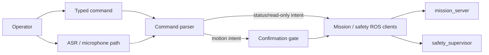

# Voice And Operator Interface Architecture

Owner: Voice / Operator Interface Agent  
Secondary: Navigation / Mission / Safety Agent  
Status: Active, early

This block owns operator-facing voice/text commands and their safe conversion into mission or status requests.

## Responsibility

- Voice/text command parsing.
- Wake-word or typed command gating.
- Confirmation before motion-causing intents.
- User feedback for accepted, denied, failed, or unavailable commands.
- Calling mission and safety clients rather than bypassing them.

## Operator Interface Diagram

## Detailed Sources

- `ros_ws/src/amr_voice`
- `ros_ws/src/amr_clients`
- `docs/agentic/roles/voice_operator_interface_agent.md`

## Validation

- Parser unit tests.
- Dry-run command parsing.
- Confirmation behavior tests.
- No microphone loops, TTS/audio device tests, or mission commands without explicit request.
