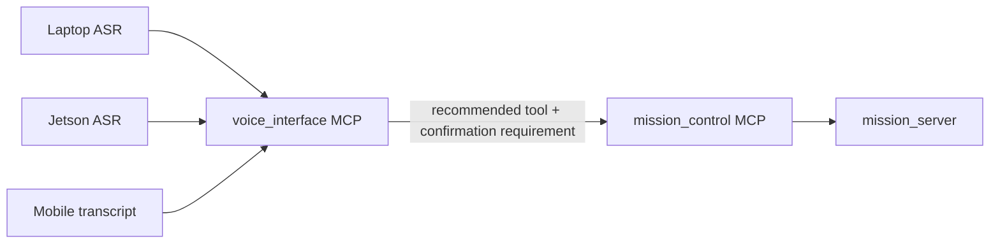

# Voice And Operator Interface Architecture

Owner: Voice / Operator Interface Agent  
Secondary: Navigation / Mission / Safety Agent  
Status: Active, early

This block owns operator-facing wake, transcript, and intent parsing for MCP-based
mission/status requests.

## Responsibility

- Wake-word detection.
- Transcript command parsing.
- Confirmation before motion-causing intents.
- User feedback for accepted, denied, failed, or unavailable commands.
- Returning recommended MCP tool calls rather than directly calling mission services.

## Operator Interface Diagram

## Detailed Sources

- `ros_ws/src/amr_voice`
- `mcp_servers/amr_voice_interface`
- `ros_ws/src/amr_clients`
- `docs/agentic/roles/voice_operator_interface_agent.md`

## MCP Boundary

The voice MCP is input-agnostic. Laptop, Jetson, or mobile audio paths should produce
plain text transcripts and submit them to `mcp_servers/amr_voice_interface`. The MCP
parses the transcript, reports whether confirmation is required, and returns the
recommended next MCP tool. It does not start ASR, command motion, call Nav2 directly,
publish `/cmd_vel`, clear faults, or bypass mission-control readiness checks.

This keeps device-specific audio capture separate from robot command semantics:

## Wake-Word Stage

The first wake-word implementation uses `openWakeWord` with the built-in
`hey_jarvis` model as the default (`AMR_WAKE_MODEL=hey_jarvis`). This is a practical
starter model because it is open source, runs locally, and is small enough for laptop
and Jetson-class hardware. Live audio and new MCP transcript parsing use `hey jarvis`
until a custom AMR wake model is trained.

`ros_ws/src/amr_voice/amr_voice/wake_word_node.py` listens to a microphone and publishes
JSON wake events on `/amr_voice/wake_word`. It does not command motion or call mission
services.

`ros_ws/src/amr_voice/amr_voice/vad_node.py` uses Silero VAD through `openwakeword.vad`
and publishes JSON speech boundary events on `/amr_voice/vad`. It does not parse
commands, submit transcripts, command motion, or call mission services. Later ASR and
TTS stages should subscribe to wake/VAD events or share the same audio device pipeline,
then submit transcripts to the voice MCP.

## Removed Legacy Path

The old `voice_text_cli`, `voice_command_node`, and `voice_asr_node` nodes directly
called AMR mission ROS services. They have been removed from the MCP integration
branch so the new voice work cannot accidentally bypass the voice MCP and
mission-control MCP boundaries.

## Validation

- Parser unit tests.
- Dry-run command parsing.
- Confirmation behavior tests.
- No microphone loops, TTS/audio device tests, or mission commands without explicit request.
