# Manipulator And MoveIt Architecture

Owner: Manipulator / MoveIt Agent  
Secondary: ROS Core / Hardware Interface Agent  
Status: Active bench bring-up

This block owns the SO-101 manipulator stack on the AMR. The current physical
direction is one mounted SO-101 arm, with a webcam mounted above the gripper as
part of the manipulator stack. The AMR base RealSense remains the broad
navigation/scene sensor; the wrist webcam is for close-range manipulation
inspection, calibration, and grasp verification.

## Current Implementation

- `ros_ws/src/amr_description/urdf/so101.xacro` adds an optional single SO-101
  planning/TF model based on the upstream TheRobotStudio/SO-ARM100 SO101 URDF
  and STL mesh assets.
- `ros_ws/src/amr_description/urdf/so101_upstream.xacro` wraps the vendored
  upstream model with `so101_`-prefixed names, an AMR mount frame, `so101_tool0`,
  and wrist-webcam frames.
- `ros_ws/src/amr_description/urdf/amr.urdf.xacro` keeps the arm disabled by
  default and enables it with `enable_so101:=true`.
- `ros_ws/src/amr_description/launch/view_so101_amr.launch.py` renders the AMR
  with the mounted SO-101 for RViz inspection.
- `ros_ws/src/amr_description/config/so101_named_poses.yaml` records
  encoder-captured named poses for supervised teleop and MoveIt bring-up:
  `home`, `carry`, `look_from_height`, `ready_to_pick_up`, and aliases.
- `ros_ws/src/amr_so101_moveit_config` provides the current SO-101 MoveIt2
  config. It starts in planning/fake-motion mode by default and can optionally
  include the SO-101 driver bridge.
- `ros_ws/src/amr_so101_driver` provides the first hardware execution bridge:
  `/so101_trajectory_bridge` serves
  `/so101_arm_controller/follow_joint_trajectory` and publishes
  `/so101/joint_states`; `/amr_joint_state_merger` merges
  `/amr/joint_states` and `/so101/joint_states` into `/joint_states`.
- `ros_ws/src/amr_description/launch/so101_wrist_webcam.launch.py` provides the
  generic USB wrist-webcam launch path using `usb_cam`.

The default path remains hardware-passive. Real SO-101 execution must be
explicitly enabled; the conservative default is still wrist-roll-only, while the
current supervised Orin bring-up has validated all-six-joint teleop through the
bridge. The current arm mount and wrist-camera poses are first-pass guesses
until the physical AMR top-plate mount and camera extrinsics are measured.

## Current Bench Status

- Orin MoveIt2 planning and execution have launched successfully with
  `move_group`, RViz, the SO-101 bridge, and the AMR base joint-state merger.
- The SO-101 controller has enumerated on Orin as
  `/dev/serial/by-id/usb-1a86_USB_Single_Serial_5A7A058493-if00`.
  USB-A hub enumeration is the current reliable path; direct USB-C enumeration
  was not reliable during bring-up.
- All six STS3215 motors responded at IDs 1-6.
- Low-level wrist-roll motion was validated through the Feetech/LeRobot bus, and
  MoveIt bridge teleop has driven the six available joints under supervision.
- The bridge publishes `/so101/joint_states`, serves
  `/so101_arm_controller/follow_joint_trajectory`, exposes `/so101/free_servos`,
  and merges `/amr/joint_states` plus `/so101/joint_states` into global
  `/joint_states`.
- Wrist webcam enumeration and streaming are working through `usb_cam`; the
  low-bandwidth NUC preview topic is `/so101/preview/wrist_camera/image_raw`.
- Current joint limits need calibration against the physical SO-101. Some
  recorded safe poses are outside the starter MoveIt/URDF limits, so do not
  blindly widen limits; release servos, record min/max per joint, and update
  URDF/MoveIt/teleop limits with margin.

## Responsibility

- SO-101 URDF/Xacro and integration with the AMR base TF tree.
- MoveIt2 configuration, planning scene, joint limits, and named poses.
- Arm driver, gripper interface, calibration frames, and guarded execution.
- Separation between perception proposals and actuator commands.
- VLA policy experiments as proposal/planning inputs, not direct actuator control.

## Diagram

```mermaid
flowchart LR
  TASK[Task / operator request]
  MCP[Future manipulation MCP\nguarded]
  PERCEPTION[Perception / VLA proposals]
  GUARD[Plan-before-execute guard]
  MOVEIT[MoveIt2 planning]
  SCENE[Planning scene + collision model]
  ACTION[/so101_arm_controller/follow_joint_trajectory/]
  DRIVER[amr_so101_driver\ntrajectory bridge]
  MERGER[amr_joint_state_merger]
  ARM[SO-101 manipulator]
  FEEDBACK[Joint state / gripper feedback]

  TASK --> MCP
  PERCEPTION --> MCP
  MCP --> GUARD
  GUARD --> MOVEIT
  SCENE --> MOVEIT
  MOVEIT --> ACTION
  ACTION --> DRIVER
  DRIVER --> ARM
  ARM --> FEEDBACK
  FEEDBACK --> MERGER
  MERGER -->|/joint_states| SCENE
  FEEDBACK --> SCENE
```

## Detailed Sources

- `ros_ws/src/amr_description/urdf/so101.xacro`
- `ros_ws/src/amr_description/urdf/so101_upstream.xacro`
- `ros_ws/src/amr_description/urdf/so101/ATTRIBUTION.md`
- `ros_ws/src/amr_description/meshes/so101/assets`
- `ros_ws/src/amr_description/config/so101_named_poses.yaml`
- `ros_ws/src/amr_so101_moveit_config`
- `ros_ws/src/amr_so101_driver`
- `CAD/6 Exports/STEP/SO101` as mechanical reference for AMR mount placement
  and enclosure/cable clearance checks.
- `docs/agentic/roles/manipulator_moveit_agent.md`
- `docs/perception/vla_manipulation_layers.md`

## Validation

- Xacro render smoke test for `amr.urdf.xacro enable_so101:=true`.
- RViz inspection of base, arm, `so101_tool0`, and wrist webcam frames.
- Physical measurement of arm mount offset and wrist-camera extrinsics before
  using the model for planning.
- MoveIt config validation through fake mode before hardware execution.
- For combined base + arm, launch AMR base joint states on `/amr/joint_states`,
  SO-101 on `/so101/joint_states`, and consume merged `/joint_states`.
- Planning/fake-hardware smoke tests before any hardware execution.
- Real hardware execution starts wrist-roll-only by default. All-six execution is
  for explicit supervised bring-up only until joint limits, torque margins, and
  mount/camera calibration are finished.
- No arm trajectory or gripper actuation without explicit supervised confirmation.
- VLA proposals must be checked by MoveIt planning and operator approval before execution.
