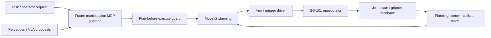

# Manipulator And MoveIt Architecture

Owner: Manipulator / MoveIt Agent  
Secondary: ROS Core / Hardware Interface Agent  
Status: Future

This block will own the SO-101 manipulator stack once it is integrated into the AMR.

## Planned Responsibility

- SO-101 URDF/Xacro and integration with the AMR base TF tree.
- MoveIt2 configuration, planning scene, joint limits, and named poses.
- Arm driver, gripper interface, calibration frames, and guarded execution.
- Separation between perception proposals and actuator commands.
- VLA policy experiments as proposal/planning inputs, not direct actuator control.

## Planned Diagram

## Detailed Sources

- Future manipulator packages under `ros_ws/src`.
- `CAD/6 Exports/STL/SO101` as mechanical reference only until promoted.
- `docs/agentic/roles/manipulator_moveit_agent.md`
- `docs/perception/vla_manipulation_layers.md`

## Validation

- URDF and MoveIt config validation once packages exist.
- Planning-only smoke tests before any hardware execution.
- No arm trajectory or gripper actuation without explicit supervised confirmation.
- VLA proposals must be checked by MoveIt planning and operator approval before execution.
