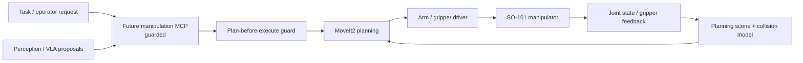

# Manipulator And MoveIt Architecture

Owner: Manipulator / MoveIt Agent  
Secondary: ROS Core / Hardware Interface Agent  
Status: Active scaffold

This block owns the SO-101 manipulator stack on the AMR. The current physical
direction is one mounted SO-101 arm, with a webcam mounted above the gripper as
part of the manipulator stack. The AMR base RealSense remains the broad
navigation/scene sensor; the wrist webcam is for close-range manipulation
inspection, calibration, and grasp verification.

## Current Scaffold

- `ros_ws/src/amr_description/urdf/so101.xacro` adds an optional single SO-101
  planning/TF model based on the upstream TheRobotStudio/SO-ARM100 SO101 URDF
  and STL mesh assets.
- `ros_ws/src/amr_description/urdf/so101_upstream.xacro` wraps the vendored
  upstream model with `so101_`-prefixed names, an AMR mount frame, `so101_tool0`,
  and wrist-webcam frames.
- `ros_ws/src/amr_description/urdf/amr.urdf.xacro` keeps the arm disabled by
  default and enables it with `enable_so101:=true`.
- `ros_ws/src/amr_description/launch/view_so101_amr.launch.py` renders the AMR
  with the mounted SO-101 for RViz inspection.
- `ros_ws/src/amr_description/config/so101_named_poses.yaml` records starter
  planning-only named poses for future MoveIt setup.

The scaffold is intentionally hardware-passive. It does not add arm drivers,
trajectory controllers, gripper actuation, or execution launch files.
The current arm mount and wrist-camera poses are first-pass guesses until the
physical AMR top-plate mount and camera extrinsics are measured.

## Responsibility

- SO-101 URDF/Xacro and integration with the AMR base TF tree.
- MoveIt2 configuration, planning scene, joint limits, and named poses.
- Arm driver, gripper interface, calibration frames, and guarded execution.
- Separation between perception proposals and actuator commands.
- VLA policy experiments as proposal/planning inputs, not direct actuator control.

## Diagram

## Detailed Sources

- `ros_ws/src/amr_description/urdf/so101.xacro`
- `ros_ws/src/amr_description/urdf/so101_upstream.xacro`
- `ros_ws/src/amr_description/urdf/so101/ATTRIBUTION.md`
- `ros_ws/src/amr_description/meshes/so101/assets`
- `ros_ws/src/amr_description/config/so101_named_poses.yaml`
- `CAD/6 Exports/STEP/SO101` as mechanical reference for AMR mount placement
  and enclosure/cable clearance checks.
- `docs/agentic/roles/manipulator_moveit_agent.md`
- `docs/perception/vla_manipulation_layers.md`

## Validation

- Xacro render smoke test for `amr.urdf.xacro enable_so101:=true`.
- RViz inspection of base, arm, `so101_tool0`, and wrist webcam frames.
- Physical measurement of arm mount offset and wrist-camera extrinsics before
  using the model for planning.
- MoveIt config validation once the MoveIt package exists.
- Planning-only smoke tests before any hardware execution.
- No arm trajectory or gripper actuation without explicit supervised confirmation.
- VLA proposals must be checked by MoveIt planning and operator approval before execution.
