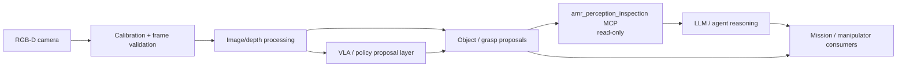

# Perception And Calibration Architecture

Owner: Perception / Calibration Agent  
Secondary: Manipulator / MoveIt Agent  
Status: Active scaffold

This block owns the first scaffold for camera/depth perception, calibration, and
structured perception outputs. The current implementation is proposal-only: it
defines contracts and an MCP surface, but it does not run live camera capture or
command robot motion.

## Planned Responsibility

- RealSense and future camera/depth pipelines.
- Camera and depth calibration.
- Frame, timestamp, and confidence handling.
- Object or grasp proposals that do not directly command actuators.
- VLA-style manipulation proposals and task plans, kept separate from execution.
- Dataset/log capture for offline perception and VLA evaluation.

## Planned Diagram

## Detailed Sources

- `ros_ws/src/amr_perception`
- `mcp_servers/amr_perception_inspection`
- `docs/agentic/roles/perception_calibration_agent.md`
- `docs/perception/vla_manipulation_layers.md`
- Datasets, logs, and calibration artifacts once promoted into governed paths.

## Validation

- Offline image/depth tests.
- Calibration file parsing and frame checks.
- MCP smoke test for read-only perception tools.
- No live camera capture loops or manipulation execution without explicit request.
