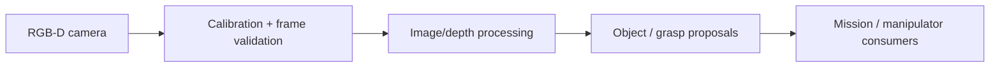

# Perception And Calibration Architecture

Owner: Perception / Calibration Agent  
Secondary: Manipulator / MoveIt Agent  
Status: Future

This block will own camera/depth perception, calibration, and structured perception outputs.

## Planned Responsibility

- RealSense and future camera/depth pipelines.
- Camera and depth calibration.
- Frame, timestamp, and confidence handling.
- Object or grasp proposals that do not directly command actuators.

## Planned Diagram

## Detailed Sources

- Future perception packages under `ros_ws/src`.
- `docs/agentic/roles/perception_calibration_agent.md`
- Datasets, logs, and calibration artifacts once promoted into governed paths.

## Validation

- Offline image/depth tests.
- Calibration file parsing and frame checks.
- No live camera capture loops or manipulation execution without explicit request.
