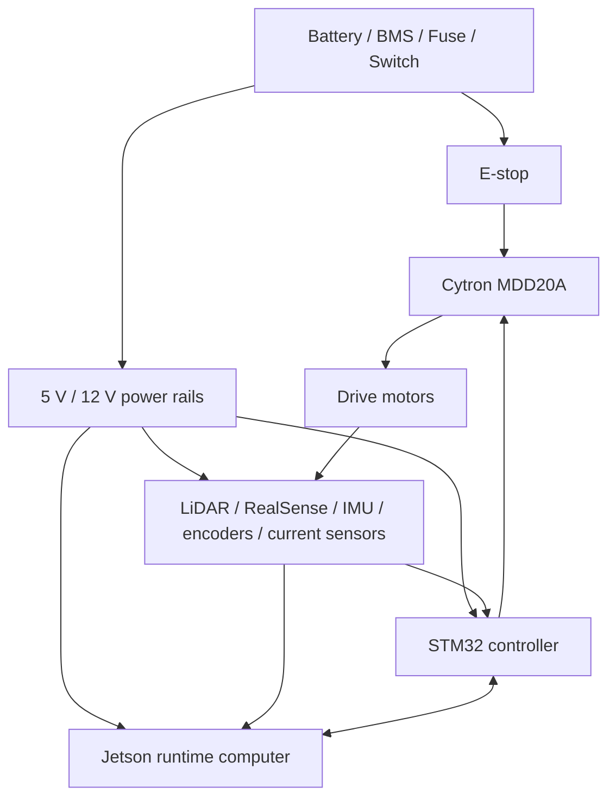

# Physical Hardware Architecture

Owner: STM Firmware Agent  
Secondary: Runtime Environment Agent  
Status: Active

This is the architecture-facing summary for physical hardware. Detailed wiring and component specifics remain under `docs/hardware`.

## Responsibility

- Power distribution, motor driver, STM32, Jetson, sensors, and physical safety interfaces.
- Relationship between compute, firmware, drive hardware, sensors, and wiring.
- Hardware constraints that affect runtime, firmware, or ROS behavior.

## Physical Block Diagram

## Detailed Sources

- `docs/hardware/hardware_block_diagram.md`
- `docs/hardware/wiring_schematic.md`
- `docs/hardware/pin_map.yaml`
- `docs/hardware/Component_specifications.md`

## Current Detailed Diagrams Owned Here

- Hardware block diagram.
- Wiring schematic diagrams.

## Validation

- Documentation review and pin-map consistency checks.
- Hardware acceptance only when physically present and supervised.
