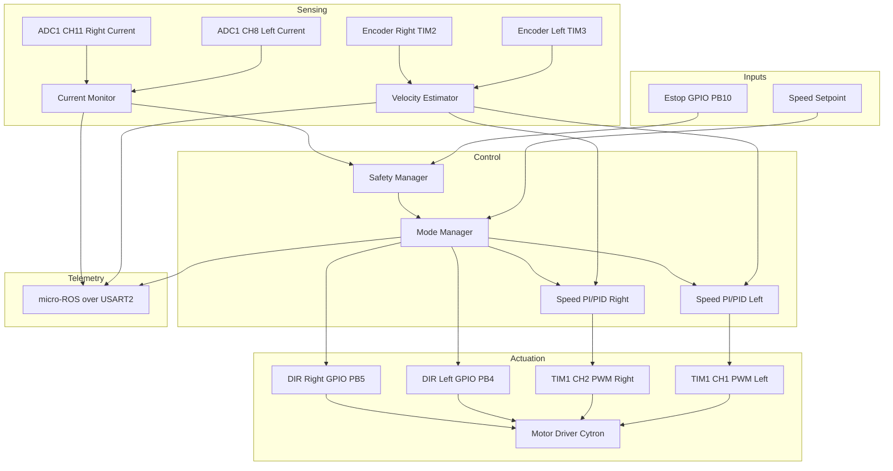
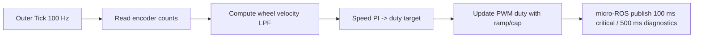
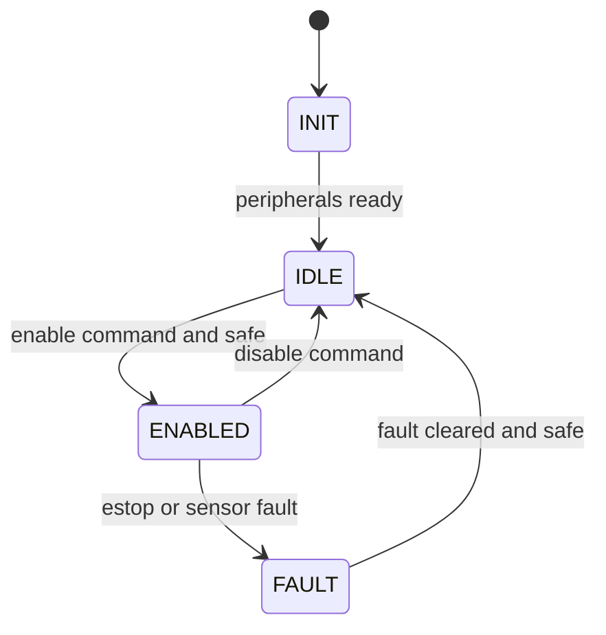
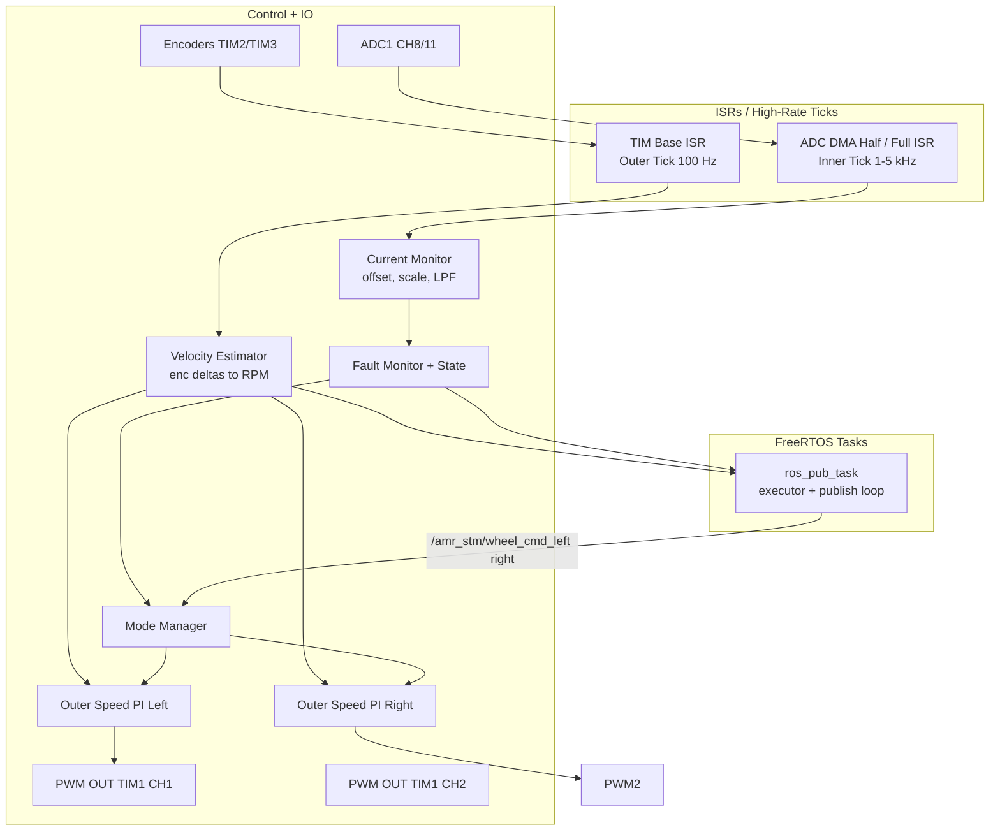

# STM32 Architecture (Firmware + micro-ROS)

Owner: Kartik Mehta  
Status: In progress - dual-motor speed PI with ramp; current used for protection; micro-ROS client active on USART2 with wheel-command + enable/estop/clear subscribers and wheel-state + diagnostic publishers.  
Last Updated: 2026-05-09

## Current Implementation Snapshot
- Control loop: TIM4 at 100 Hz; speed PI per wheel; duty ramp; differential-drive mapping from left/right wheel command topics; command staleness timeout (500 ms).
- Sensing: encoders TIM3 (left, 16-bit) / TIM2 (right, 32-bit) with RPM LPF; ADC1 CH8/11 current sense (ACS758) with scaling and LPF.
- Faults: overcurrent, stall, encoder timeout, ADC stuck detection; fault mask latched in ControlState and cleared via `/amr_stm/clear_fault` when faults/estop are inactive.
- micro-ROS: USART2 custom transport over the STM32 ST-LINK virtual COM path; subscribers are `/amr_stm/wheel_cmd_left`, `/amr_stm/wheel_cmd_right`, `/amr_stm/enable`, `/amr_stm/estop`, `/amr_stm/clear_fault`; publishers are `/amr_stm/wheel_state`, `/amr_stm/fault_mask`, `/amr_stm/safety_state`, `/amr_stm/duty_cmd_left`, `/amr_stm/duty_cmd_right`, `/amr_stm/current_left_ma`, `/amr_stm/current_right_ma`, `/amr_stm/current_left_adc`, `/amr_stm/current_right_adc`, `/amr_stm/current_left_zero`, `/amr_stm/current_right_zero`, and `/amr_stm/ros_diag`. Critical topics publish every 100 ms; current/ADC diagnostics publish every 500 ms.
- PWM/Dir: TIM1 CH1/CH2 at 20 kHz; DIR PB4/PB5; duty capped at 70%.
- Legacy UART telemetry: disabled to avoid contention with micro-ROS on USART2.
- Diagnostics policy: all current, duty, fault, and safety topics are intentionally still published. Some are mainly used by bench/monitor tools, but none are being pruned from firmware yet.

## Goals
- Deterministic control on STM32: dual-wheel speed PI (single-loop) with smooth ramps.
- Current sensing used for protection/diagnostics (not in the control loop).
- micro-ROS interface for per-wheel commands, enable/estop/clear, and telemetry.
- Safety gating and fault latching.

## Peripherals and IO
- PWM: TIM1 CH1/CH2 at 20 kHz (PA8/PA9).
- DIR GPIO: PB4/PB5.
- Encoders: TIM3 (left PA6/PA7), TIM2 (right PA0/PA1).
- ADC: ADC1 CH8 (PB0), CH11 (PC1) for ACS758 current.
- UART: USART2 460800 bps for micro-ROS custom transport.
- E-stop sense: PB10 (active low, pull-up).

## Parameters (current values in app_config.h)
- Geometry: TRACK_WIDTH_M=0.381, WHEEL_RADIUS_M=0.0615.
- Control loop: CONTROL_LOOP_HZ=100; CMD_TIMEOUT_MS=500.
- Duty limits: MOTOR_DUTY_MAX=0.70; DUTY_RAMP_RATE_PER_SEC=1.0.
- Command ramping: CMD_RAMP_ENABLE=0; V_CMD_RAMP_RATE_MPS=0.8 and W_CMD_RAMP_RATE_RAD=0.8 are configured for firmware command ramping if it is re-enabled.
- RPM filtering: RPM_LPF_ALPHA=0.05; RPM_SPIKE_LIMIT_RPM=500.
- Speed PI: KP/KI per wheel; output clamped to +/-0.90; I clamped to +/-2.0.
- Current sense: divider ratio 0.667; LPF alpha 0.1; zero tracking disabled with CURR_ZERO_TRACK_ALPHA=0.0 during current-sensor calibration.
- Fault thresholds:
  - OC: 1500 mA with 50 ms dwell.
  - Stall: duty >= 8% and |RPM| <= 0.5 for 500 ms.
  - Encoder timeout: cmd RPM >= 0.5 and measured ~0 for 1000 ms.
  - ADC stuck: 30 samples at rail or identical values (when |duty| >= 2%).

## Loop Rates and Ownership
- Inner/current tick: reserved (1-5 kHz) tied to PWM/ADC (deferred until higher-accuracy sensor).
- Outer/speed loop: 100 Hz via TIM4. Computes RPM, runs speed PI, updates duty targets.
- micro-ROS publish: critical STM topics every 100 ms; current/ADC diagnostic topics and `/amr_stm/ros_diag` every 500 ms.
- ISRs/ticks own control math; RTOS tasks move messages/buffers.

## Data Flow (single-loop)
1) Receive `/amr_stm/wheel_cmd_left` and `/amr_stm/wheel_cmd_right` via micro-ROS; store latest with timestamps.
2) Outer tick: read left/right wheel commands, clamp, apply ramp, run speed PI -> duty targets.
3) Apply duty via TIM1 CH1/CH2 (DIR set per polarity).
4) Sense: encoder deltas -> RPM (LPF); currents -> filtered for protection.
5) Fault monitor computes fault_bits; ControlState latches faults.
6) micro-ROS publishes wheel_state plus fault, safety, duty, and current diagnostics.

## Motor Control Diagrams

## micro-ROS Integration Architecture

Current topics
- Sub: `/amr_stm/wheel_cmd_left`, `/amr_stm/wheel_cmd_right` (std_msgs/Float32, wheel angular velocity command in rad/s as currently consumed by the firmware).
- Sub: `/amr_stm/enable` (std_msgs/Bool), `/amr_stm/estop` (std_msgs/Bool), `/amr_stm/clear_fault` (std_msgs/Empty).
- Pub: `/amr_stm/duty_cmd_left`, `/amr_stm/duty_cmd_right` (std_msgs/Float32, duty percent).
- Pub: `/amr_stm/fault_mask` (std_msgs/Int32).
- Pub: `/amr_stm/wheel_state` (sensor_msgs/JointState).
- Pub: `/amr_stm/safety_state` (std_msgs/UInt32).
- Pub: `/amr_stm/current_left_ma`, `/amr_stm/current_right_ma` (std_msgs/Int32, filtered current estimate in mA).
- Pub: `/amr_stm/current_left_adc`, `/amr_stm/current_right_adc` (std_msgs/UInt32, raw ADC sample).
- Pub: `/amr_stm/current_left_zero`, `/amr_stm/current_right_zero` (std_msgs/UInt32, zero-offset estimate).
- Pub: `/amr_stm/ros_diag` (std_msgs/UInt32MultiArray, micro-ROS diagnostics).

## Fault Mask (current bits)
- Bit 0: CTRL_FAULT_ESTOP
- Bit 1: CTRL_FAULT_OC_LEFT
- Bit 2: CTRL_FAULT_OC_RIGHT
- Bit 3: CTRL_FAULT_STALL_LEFT
- Bit 4: CTRL_FAULT_STALL_RIGHT
- Bit 5: CTRL_FAULT_ENC_TIMEOUT_LEFT
- Bit 6: CTRL_FAULT_ENC_TIMEOUT_RIGHT
- Bit 7: CTRL_FAULT_ADC_STUCK
- Bit 15: CTRL_FAULT_GENERIC

## Implementation Mapping
- Control loop + tasks: `STM/STM_Firmware_AMR_v2/Core/Src/main.c` (control_task at 100 Hz, ros_pub_task executor + publish).
- Control law + ramps: `STM/STM_Firmware_AMR_v2/Core/Src/control_loop.c`.
- Fault detection: `STM/STM_Firmware_AMR_v2/Core/Src/fault_monitor.c`.
- State machine and fault latch: `STM/STM_Firmware_AMR_v2/Core/Src/control_state.c`.
- Current sensing: `STM/STM_Firmware_AMR_v2/Core/Src/current_sense.c`.

## Known Gaps
- voltage faults pending ADC/BMS integration.

## Next Steps
- Add voltage faults when available.
- Optional: per-wheel feedforward to reduce duty skew; finalize PI gains and log overshoot with `Workspace/python_scripts/check_overshoot.py`.
- Defer cascaded current control unless needed; keep current for protection/logging.
