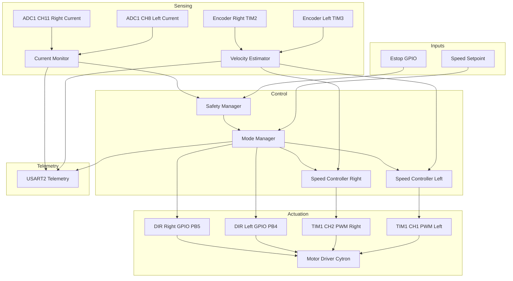
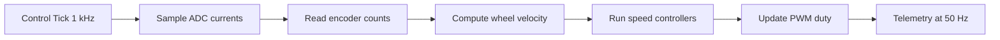
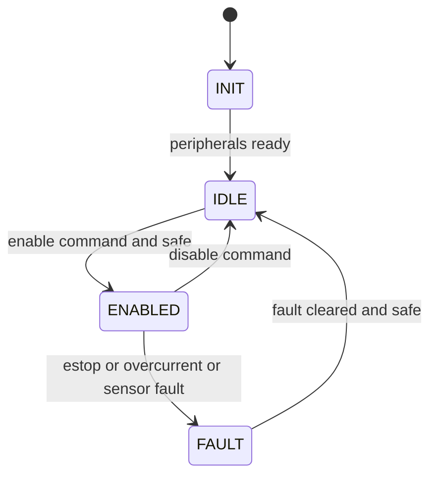

# STM32 Firmware — Motor Control Diagrams

This document explains the intended motor control model and how it maps to the STM32 firmware setup. It also notes current implementation status in the firmware.

- Setpoint enters Mode Manager, which gates control based on Safety Manager.
- Encoders feed the velocity estimator; current sensors feed the current monitor.
- Speed controllers produce duty commands to TIM1 PWM; direction is set via GPIO.
- Telemetry publishes selected signals over USART2.

- Target loop rate example: 1 kHz control tick for smooth speed control.
- ADC samples left and right motor currents; encoder deltas compute velocity.
- Speed controllers update PWM; telemetry decimated to ~50 Hz.

- INIT: clocks and peripherals configured.
- IDLE: outputs disabled, waiting for enable.
- ENABLED: control loop active, PWM driving motors.
- FAULT: outputs latched off until manual clear and safe.

Implementation mapping (current)
- PWM generation: `STM_Firmware_AMR_v2/Core/Src/main.c:242` initializes TIM1 with CH1 and CH2. `STM_Firmware_AMR_v2/Core/Src/motor.c` applies duty via compare registers.
- Direction GPIO: `STM_Firmware_AMR_v2/Core/Src/main.c:471` configures PB4 and PB5 as outputs; `STM_Firmware_AMR_v2/Core/Src/motor.c` sets direction pins.
- Encoders: `STM_Firmware_AMR_v2/Core/Src/main.c:311` TIM2 and `STM_Firmware_AMR_v2/Core/Src/main.c:360` TIM3 configured in encoder mode (filters enabled per `.ioc`).
- Current sensing: `STM_Firmware_AMR_v2/Core/Src/main.c:181` ADC1 configured with channels 8 and 11 (left and right current).
- Telemetry serial: `STM_Firmware_AMR_v2/Core/Src/main.c:409` USART2 at 460800 bps.

Notes and next steps
- Current firmware runs a fixed 10 percent duty on left motor for bring up; encoder readout, ADC sampling, and control loop are not yet integrated.
- Next steps typically include starting encoder timers, adding a periodic control tick (e.g., TIM base or SysTick), sampling ADC each tick, computing velocity, and running PI or PID to command PWM on both channels with safety gating.

## Faults and Clear Criteria (Tentative)

Faults are detected in the Safety Manager and drive transitions to FAULT. Faults are latched until clear criteria are met. The list below is a starting point and can be refined as hardware is finalized.

Fault table (proposed)
- ESTOP_ACTIVE
  - Condition: E-stop input indicates stop asserted (active level after debounce)
  - Action: Immediate FAULT; force PWM outputs to 0; ignore enable
  - Clear: E-stop released (inactive for >= 50 ms) and manual clear requested
- OVERCURRENT_LEFT / OVERCURRENT_RIGHT
  - Condition: Filtered current exceeds Ithresh_L/R for > T_over_ms (e.g., 20–50 ms)
  - Action: FAULT; force PWM 0; record which side tripped
  - Clear: Current below Ithresh_clear for >= 200 ms and manual clear requested
- ENCODER_TIMEOUT_LEFT / ENCODER_TIMEOUT_RIGHT
  - Condition: Commanded speed magnitude > v_min_cmd and no encoder edges for > T_enc_ms
  - Action: FAULT (mechanical/electrical issue suspected)
  - Clear: Encoder activity resumes for that wheel and manual clear requested
- ADC_RANGE_FAULT
  - Condition: ADC reading stuck at 0 or max code for > N samples (channel-specific)
  - Action: FAULT; treat sensors unreliable
  - Clear: ADC readings return to nominal range for >= 200 ms and manual clear requested
- SUPPLY_UNDERVOLT / SUPPLY_OVERVOLT (from BMS or ADC if monitored)
  - Condition: Pack voltage below/above thresholds with hysteresis for > T_uv/ov
  - Action: FAULT; optionally pre-fault warn and ramp down
  - Clear: Voltage back within safe band for >= 1 s and manual clear requested
- DRIVER_FAULT (if driver has a fault pin/telemetry)
  - Condition: Motor driver reports fault state
  - Action: FAULT
  - Clear: Driver clears fault and manual clear requested

Recommended thresholds (to be tuned)
- Overcurrent Ithresh: based on motor/driver ratings; start with 1.2x nominal and time filter 25 ms
- Encoder timeout T_enc_ms: 200–300 ms when |v_cmd| > small threshold
- ADC stuck detection: 64 consecutive identical max/min codes or near-DC with zero variance
- Under/Over-voltage: per battery chemistry; include hysteresis bands

Clear policy
- Non-sticky conditions (e.g., brief noise) do not set FAULT; use time filters.
- Sticky FAULT requires both:
  - All fault conditions inactive and stable for the specified dwell time.
  - Explicit clear request (`clear_fault_cmd`) from host/CLI or user input.
- On clear, transition to IDLE; require `enable_cmd` to enter ENABLED.

Suggested fault mask (bit assignment)
- Bit 0: ESTOP_ACTIVE
- Bit 1: OVERCURRENT_LEFT
- Bit 2: OVERCURRENT_RIGHT
- Bit 3: ENCODER_TIMEOUT_LEFT
- Bit 4: ENCODER_TIMEOUT_RIGHT
- Bit 5: ADC_RANGE_FAULT
- Bit 6: SUPPLY_UNDERVOLT
- Bit 7: SUPPLY_OVERVOLT
- Bit 8: DRIVER_FAULT
- Bits 9–15: reserved

Telemetry
- Include `state`, `fault_mask`, and debounced inputs in the 50 Hz telemetry frame for observability.
