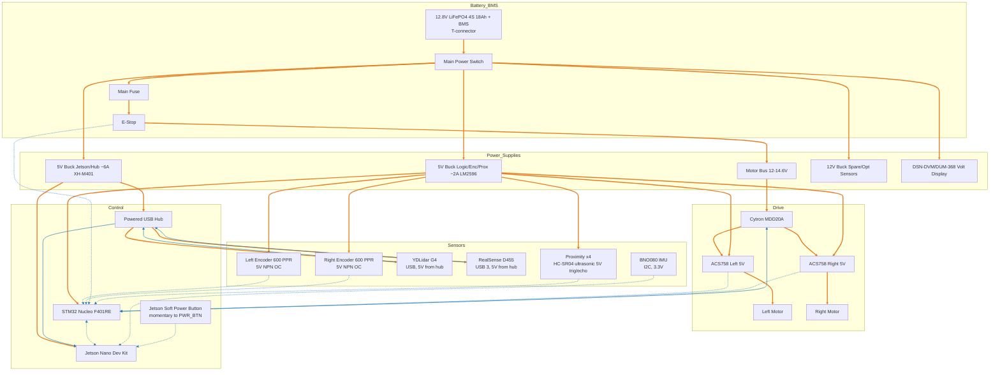

# AMR Hardware Block Diagram

- Encoders are powered from the 5 V logic rail and feed open-collector signals to the STM32 with pull-ups.
- Powered USB hub arrows are correct: LiDAR and RealSense data go to the hub, hub data to Jetson; hub + Jetson 5 V both come from the Jetson/USB buck.
- Power links are thick/orange; data/sense links are thinner/blue for quick visual separation.
- Main power switch sits at pack output ahead of fuse and E-Stop for full isolation during service/storage.
- Battery voltage display (DSN-DVM/DUM-368) taps the pack after the main switch so it is off when the robot is off.
- Proximity sensors: 4x HC-SR04 ultrasonic modules (5 V, trig/echo) wired to STM32 GPIO; stagger triggers to avoid crosstalk.
- IMU: BNO080 on Jetson I2C (3.3 V). Power from Jetson 3.3 V rail; keep cable short and avoid vibration.
- Jetson soft power button: momentary N.O. switch across JET PWR_BTN to GND for graceful shutdown/start (no power cut).
