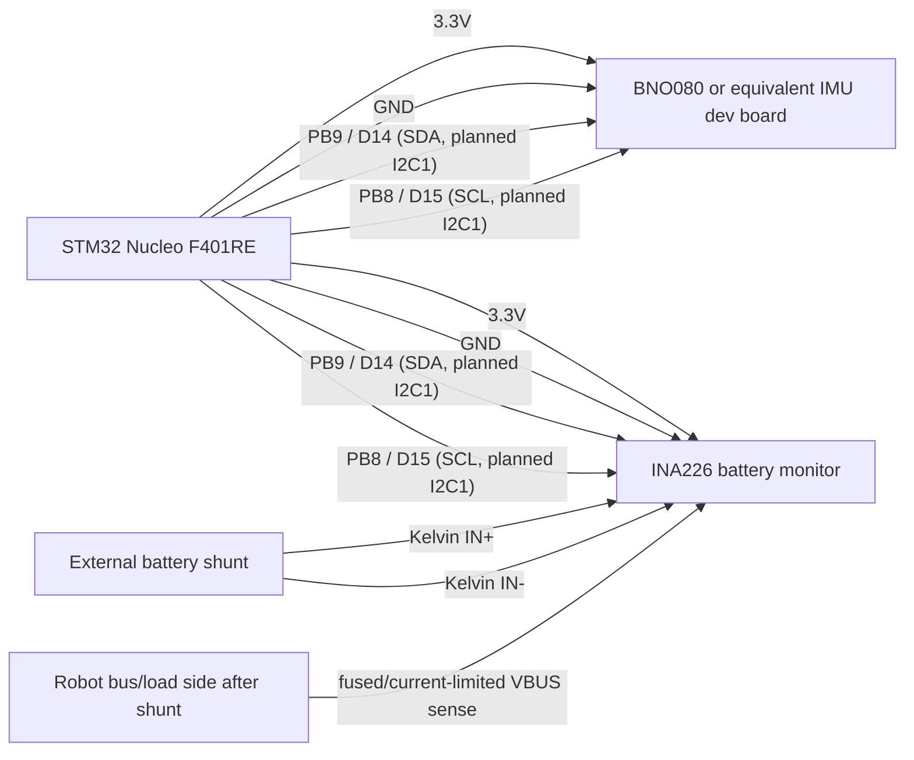
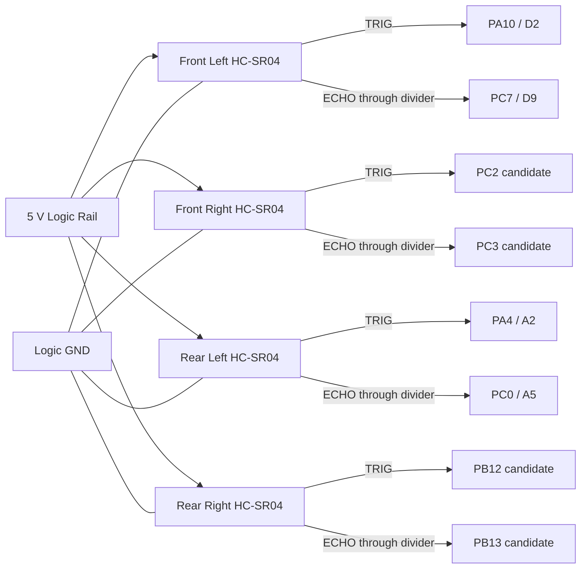

# AMR Wiring and Power Schematic (Text Overview)

This document captures the practical wiring plan for the AMR project: power distribution, E-stop, and signal interconnects between the STM32 controller, motor driver, encoders, Jetson Nano, and sensors. Pin mapping is authoritative in `docs/hardware/pin_map.yaml`.

---

## 1) Power Distribution

- Battery: 12.8 V LiFePO4 4S, 18 Ah (pack has basic internal BMS)
  - Main Fuse: size for expected peak (e.g., 30-40 A slow-blow for current drivetrain; revisit after measurements)
  - Main switch to cut all rails (upstream of fuse/E-stop); E-stop contactor in motor path (see E-stop section)
  - Branches:
    - Motor Power Bus + Motor Driver VM (Cytron MDD20A)
    - DC-DC Buck/Boost 5 V (Jetson Nano, powered USB extension/hub) — XH-M401 / XL4016 class or equivalent regulated 5 V supply
    - DC-DC Buck 5 V/12 V for sensors (LiDAR, depth cam, HC-SR04 proximity) — LM2596 for 5 V logic rail; 12 V optional if needed
  - Battery voltage display (DSN-DVM-368) fed after main switch so it is off when the robot is off

Notes
- Use star ground: join motor return, STM32 GND, Jetson GND, and sensor grounds at a solid common point.
- Size DC-DC modules with margin (Jetson Nano can draw 3-4 A peak on 5 V; depth cameras and LiDAR add significant load). The powered USB extension/hub should take its peripheral 5 V from the buck/boost, not from the Jetson USB port.
- Keep motor currents off the logic 5 V/3.3 V rails; separate power domains that meet at ground.

### 1a) Power Distribution Details
- Battery Pack: 12.8 V LiFePO4 4S 18 Ah with internal basic BMS. Outputs raw pack voltage; no regulated 5 V/12 V and limited telemetry.
- DC-DC 5 V Jetson/USB Rail: 5 V buck/boost with ~6-8 A continuous to power Jetson Nano plus the powered USB extension/hub. Use inline fuses per branch (Jetson 4-5 A, USB extension/hub sized to attached sensors). The USB extension/hub 5 V input should come from this rail so LiDAR/depth-camera current is not sourced through the Jetson.
- Jetson Nano power: feed the barrel jack (J48 set for DC-in). Avoid micro-USB for full load.
- STM32 power: feed E5V/VIN on the Nucleo. Avoid back-powering if USB is also connected (set the Nucleo power select to external or remove the USB 5 V link per board manual).
- DC-DC 12 V Sensors (optional): only if any sensor requires 12 V; otherwise omit.

Battery monitoring (planned)
- Planned preferred telemetry path: INA226 I2C monitor with an external 50 A minimum, preferably 75 A or 100 A, shunt placed after the main switch and main fuse, before the robot power branches split.
- Main battery current must pass through the external shunt, not through the INA226 PCB. Use bolted/crimped high-current wiring through the shunt and thin Kelvin sense wires from the shunt to INA226 `IN+` and `IN-`.
- INA226 reads shunt voltage, robot bus voltage, and calculated power over I2C. Planned ownership is STM I2C on `PB8/PB9`, shared with the IMU. Firmware/ROS telemetry will be added later when proximity sensors, IMU, and battery monitoring are implemented together.
- Fallback voltage-only path: add a resistive divider from the robot bus/load side of the shunt to an ADC input (on STM32 or a small monitor) to estimate state of charge and low-voltage cutoff warnings. Choose values to keep ADC input under 3.3 V at 14.6 V full charge.
- Optional panel display: DSN-DVM/DUM-368 wired after the main switch across pack P+/P- for at-a-glance pack voltage; goes dark when the main switch is off (2-wire variant is self-powered; 3-wire adds separate sense lead).
- Do not assume the panel display provides a data output. Typical 2-wire/3-wire LED voltmeter modules only expose power/sense wiring; the yellow sense wire on 3-wire modules is an input to the display, not telemetry for STM/Jetson.
- The battery has an unused 5/6-pin connector that is not yet identified. Treat it as potentially a balance, thermistor, or BMS communication connector. Verify pinout, voltages, and isolation with the battery vendor documentation and a meter before connecting it to STM32, Jetson, or any USB adapter.
- Optional STM ADC fallback input path: robot bus/load side of the shunt -> small inline fuse or current-limited tap -> high-value divider -> series resistor/RC filter/clamp -> STM32 ADC pin TBD. Final resistor values and exact header pin must be confirmed before wiring.

Wiring intent
- Battery/BMS + Main Fuse + external shunt + power distribution + E-stop + Motor Power Bus + Motor driver VM.
- Battery/BMS + DC-DC 5 V Jetson/USB buck/boost + Jetson Nano, powered USB extension/hub.
- Battery/BMS + DC-DC 5 V Logic (LM2596) + STM32, proximity sensors.
- Battery/BMS + DC-DC 12 V Sensors + 12 V sensors (if used).

---

## 1b) Current Sensor Wiring (ACS758LCB-050B)

- Placement: One module per motor supply line; wire IP+ and IP- in series with each wheel feed.
- Power: Vcc = 5 V; GND common with STM32. Add 0.1 uF decoupling at the sensor.
- Sense output: Vout into a 10 kOhm top resistor and 20 kOhm bottom to GND; tap the midpoint to ADC (PB0 left, PC1 right). Divider ratio is 20k / (10k+20k) ~ 0.667 so 0-5 V from the sensor becomes ~0-3.33 V at the ADC.
- Filter: Add 1 kOhm series plus 100 nF to GND after the divider to reduce PWM ripple.
- Layout: Keep the IP+/IP- loop short and away from signal wiring; route Vout away from motor leads.

---

## 1c) Wiring Diagram (text/mermaid overview)

```mermaid
graph TD
  BATT[12.8 V LiFePO4<br/>B+/B-] --> MSW[Main Switch]
  MSW --> FUSE[Main Fuse]
  FUSE --> SHUNT[External Battery Shunt<br/>50A min, 75/100A preferred]
  SHUNT --> PWRDIST[Robot Power Distribution]
  PWRDIST --> ESTOP
  ESTOP --> VM[Motor Power Bus]
  ESTOP -.-> ESTOP_SENSE[PB10 / D6 E-stop sense]
  MSW --> DVM[DSN-DVM-368 Volt Display]
  SHUNT --> INA226[INA226 Battery Monitor<br/>I2C + VBUS + IN+/IN- sense]
  MSW --> BATT_TAP[Optional Voltage Sense Tap<br/>fused/current-limited]
  PWRDIST --> BUCK5V[5 V Buck/Boost >=6-8 A]
  VM --> CS_L[ACS758L Left<br/>IP+ + IP-]
  VM --> CS_R[ACS758R Right<br/>IP+ + IP-]
  CS_L --> MDD_L[MDD20A M1 VM]
  CS_R --> MDD_R[MDD20A M2 VM]

  subgraph MDD[Cytron MDD20A]
    MDD_L -- PWM PA8 --> PWM1[PA8 TIM1_CH1]
    MDD_R -- PWM PA9 --> PWM2[PA9 TIM1_CH2]
    DIRL[PB4 DIR] --> MDD_L
    DIRR[PB5 DIR] --> MDD_R
    GNDMDD[GND] -.-> PWM1
    GNDMDD -.-> PWM2
  end

  subgraph Encoders
    ENC_LA[PA6] --- ENCL[Enc L A]
    ENC_LB[PA7] --- ENCLB[Enc L B]
    ENC_RA[PA0] --- ENCR[Enc R A]
    ENC_RB[PA1] --- ENCRB[Enc R B]
    ENC_GND[GND] --- ENCG[Enc GND]
  end

  subgraph Currents to ADC
    CS_L_V[ACS758L Vout] -->|10k/20k divider + 1k/100nF| ADC_L[PB0 ADC1_IN8]
    CS_R_V[ACS758R Vout] -->|10k/20k divider + 1k/100nF| ADC_R[PC1 ADC1_IN11]
  end

  subgraph Battery Voltage to ADC
    BATT_TAP -->|optional high-value divider + RC + clamp| ADC_BATT[STM ADC fallback TBD]
  end

  INA226 -.->|STM I2C PB8/PB9, future telemetry| MCU

  BUCK5V --> FUSE_JET[5 V Fuse 4-5 A]
  BUCK5V --> FUSE_USB[5 V Fuse USB extension/hub]
  BUCK5V --> FUSE_MCU[5 V Fuse 0.5-1 A]
  FUSE_JET --> JET[Jetson Nano]
  FUSE_USB --> USBEXT[Powered USB Extension / Hub]
  USBEXT --> JET
  FUSE_MCU --> MCU[STM32F401RE (E5V/VIN)]
  JET -->|USB VCP or UART| MCU
  ESTOP_SENSE -.-> MCU
  RST_BTN[Reset Button<br/>NRST->GND] -.-> MCU
  GNDALL[GND star] -.-> MDD
  GNDALL -.-> MCU
  GNDALL -.-> JET
  GNDALL -.-> Encoders
  GNDALL -.-> CurrentstoADC
  GNDALL -.-> BatteryVoltagetoADC
```

Notes
- Insert one ACS758 per wheel supply. Keep IP+/IP- loops short. Route Vout away from motor leads.
- Insert the battery shunt after the main fuse and before branch distribution so total robot current is measured. Do not route main battery current through the INA226 PCB.
- Jetson and powered USB extension/hub on a dedicated high-current 5 V buck/boost, preferably with separate branch fuses. Logic on separate 5 V buck or shared only if capacity/noise is acceptable.
- All grounds meet at a solid star point near the power entry.

---

## 1d) Wire Gauge Guidance (initial sizing)

- Battery + Fuse + E-stop + Motor driver VM/GND: AWG 12-14, keep short and well-crimped.
- Motor driver + Motors (each channel): AWG 14-16 depending on run length and expected current; shorter runs can use 16.
- DC-DC 5 V Jetson/USB rail: AWG 16-18 from buck/boost to Jetson and powered USB extension/hub branches to minimize drop; use quality connectors.
- DC-DC 5 V Logic rail: AWG 20-22 (STM32 and light sensors).
- Encoder A/B and logic signals: AWG 24-26 twisted pair with ground return; optionally shield if noisy.
- Sensor USB cables: use powered hub for LiDAR/RealSense; keep USB leads short and rated for current.
- Grounds: implement star point with the same gauge as the largest branch it serves (typically match the supply feed gauge).

Notes
- If measured peaks exceed assumptions, upsize the affected runs one gauge thicker.
- Keep high-current runs separated from encoder and ADC wiring; cross at right angles when needed.

---

## 2) Emergency Stop (E-stop)

- Primary action: Hardware cut of Motor Power Bus feeding the motor driver VM input.
  - Option A: Latching E-stop switch in series with motor supply (simplest).
  - Option B: E-stop switch drives a relay/contactor or high-side switch that disconnects VM.
- Secondary action: STM32 reads E-stop state on a GPIO input to report and latch a software fault (PWM forced to 0 until manual clear).
- Do not rely solely on software for E-stop.

Wiring summary
- E-stop switch in series with motor supply to Cytron MDD20A VM.
- E-stop sense line + STM32 GPIO `PB10` (Arduino D6, right rail, active-low with 3.3 V pull-up).
  - Use 10 kOhm pull-up to 3.3 V (or internal pull-up if cable is short).
  - Optional debounce: 100 nF to GND at the MCU pin.
  - Optional series resistor: 100-220 Ohm at the MCU pin for ESD/EMI protection.

---

## 2a) Reset Button (NRST)

- Wire a momentary N.O. switch between NRST and GND (NRST pin on the Nucleo header).
- No external pull-up required; the Nucleo already provides a pull-up on NRST.
- Optional: 100 nF from NRST to GND near the header for EMI/debounce.
- Do not drive NRST high from an external source; leave it floating when not pressed.

---

## 3) STM32 + Motor Driver (Cytron MDD20A)

Cytron MDD20A dual channel driver is the active configuration. Connections are simple PWM plus DIR lines per channel. Keep motor supply routed through fuse and E-stop before entering the VM pin.

### Signal wiring
- PWM: `PA8 TIM1_CH1` + `M1 PWM` left wheel. `PA9 TIM1_CH2` + `M2 PWM` right wheel.
- Direction: `PB4` + `M1 DIR` left. `PB5` + `M2 DIR` right.
- Ground: Tie STM32 ground to driver logic ground close to the driver header.
- Optional brake or coast pins can stay tied per driver manual until firmware exposes those modes.

### Power wiring
- Motor power: Battery or pack output + Fuse + E-stop + Cytron MDD20A `VM`.
- Logic power: Driver logic shares ground with STM32 and is driven by the PWM and DIR inputs (no extra 5 V logic supply pin).
- Ensure motor returns and logic returns join at a solid point to avoid injecting noise into ADC grounds.

### Timing targets
- Set TIM1 prescaler plus ARR for roughly 20 kHz PWM. Higher frequencies reduce audible whine but watch driver thermal behavior.
- Keep duty updates synchronized with the inner current loop so left and right channels stay matched.

---

## 4) Encoders + STM32 (HN3806-AB-600N, open-collector)

- Signals: A, B (quadrature). Index Z if used (optional, not required for speed control).
- Voltage: 5-24 V supply supported by encoder; outputs are NPN open-collector.
- Interface to MCU:
  - Provide external pull-ups to 3.3 V on A and B (e.g., 4.7-10 kOhm).
  - Left wheel: A -> `PA6 (TIM3_CH1)`, B -> `PA7 (TIM3_CH2)` (TIM3 encoder mode).
  - Right wheel: A -> `PA0 (TIM2_CH1/ETR)`, B -> `PA1 (TIM2_CH2)` (TIM2 encoder mode).
  - Common ground between encoders and STM32.
- Filtering: Enable digital filters on TIM2/TIM3 inputs (CubeMX IC filter <= 10) to reject noise.
- Mounting: Post-gearbox (wheel/output shaft) — confirmed.
- COUNTS_PER_REV: 600 PPR * 4 = 2400 counts per wheel revolution when using TIM encoder mode TI12 (quadrature x4).
  - After changing timer mode or filtering, re-validate with the manual wheel-rotation bench test and update firmware if needed.
  - If remounted pre-gearbox (motor shaft) with 30:1 ratio: 2400 * 30 = 72,000 counts per wheel rev (update firmware accordingly).

---

## 5) STM32 + Jetson Nano

Data link options
- USB (recommended): Use the Nucleo ST-LINK Virtual COM Port. Prefer the stable `/dev/serial/by-id/usb-STMicroelectronics_STM32_STLink_*` path on Jetson, with `/dev/ttyACM0` only as a fallback. If USB is only for data, ensure the Nucleo is not back-powered from USB 5 V.
- UART (3.3 V TTL): STM32 `USART2 TX (PA2)` + Jetson `UART RX` (J41 pin 10), STM32 `USART2 RX (PA3)` + Jetson `UART TX` (J41 pin 8). GND common. Disable the Jetson serial console when using `/dev/ttyTHS1`.

Power (Jetson)
- Provide dedicated 5 V rail with sufficient current (target ~6-8 A to cover Jetson plus USB peripherals). Power Jetson via 5 V header or barrel jack per NVIDIA guidance; keep harness short and low resistance.
- Add the powered USB extension/hub as a separately powered device on the Jetson/USB 5 V buck/boost branch. Its 5 V input must come from the buck/boost, not from the Jetson USB port, so LiDAR/depth-camera current does not load the Jetson carrier.

ROS topic exchange
- Run the micro-ROS agent on the Jetson; it bridges STM32 topics into the ROS 2 graph over the selected serial link.

---

## 6) Sensors + Jetson (typical)

- LiDAR (YDLidar G4): USB (USB-to-UART) to Jetson via powered USB extension/hub; 5 V power from the extension/hub's buck/boost-fed input (budget ~0.5 A nominal; confirm peaks). Keep cable short; ensure stable 5 V.
- Depth Camera (Intel RealSense D455): USB 3.x (Type-C cable) to Jetson through the powered USB extension/hub when possible. Power from the extension/hub's regulated 5 V input; ensure USB 3 bandwidth.
- IMU dev board (Adafruit BNO080 or equivalent): I2C to STM32 (3.3 V logic, STEMMA QT/Qwiic or short jumper wiring). Power from the 3.3 V logic rail; ensure common ground and keep cable short.
  - STM planned I2C pins: SCL = `PB8` (Arduino D15 / Nucleo header), SDA = `PB9` (Arduino D14 / Nucleo header).
- Proximity Sensors: 4x HC-SR04 ultrasonic to STM32 (trigger/echo). Keep wiring short; avoid firing multiple sensors simultaneously to reduce crosstalk; level-shift echo to 3.3 V (HC-SR04 echo is 5 V). Use a simple divider (10 kOhm top / 20 kOhm bottom) or a BSS138 level shifter.
- Battery voltage sense: planned STM32 ADC input from protected pack-voltage divider. Do not connect the battery's unused 5/6-pin connector until its pinout is identified at home.

Notes
- Use the powered USB extension/hub for high-draw USB devices so the Jetson USB port carries data and does not source sensor power.
- Keep sensor grounds tied to the logic ground.

---

## 6a) IMU + INA226 Wiring Diagram (Planned STM I2C)



STM-side INA226 connector:

| INA226 signal | STM / robot connection | Conditioning |
| --- | --- | --- |
| `VCC` | STM `3.3V` logic | 100 nF close to module, plus 1-10 uF bulk near connector |
| `GND` | STM logic GND / robot ground | Same low-voltage ground reference as STM and IMU |
| `SCL` | STM `PB8` / Arduino `D15` / planned I2C1 SCL | 3.3 V pull-up, start with 4.7 kOhm; optional 22-100 ohm series damping near STM |
| `SDA` | STM `PB9` / Arduino `D14` / planned I2C1 SDA | 3.3 V pull-up, start with 4.7 kOhm; optional 22-100 ohm series damping near STM |
| `IN+` | External shunt battery/fuse side Kelvin sense | Thin Kelvin sense lead only; optional 10-100 ohm series resistor near INA226 |
| `IN-` | External shunt robot/load side Kelvin sense | Thin Kelvin sense lead only; optional 10-100 ohm series resistor near INA226 |
| `VBUS` | Robot/load positive after shunt | Fused/current-limited sense tap, 100-1 kOhm series resistance if the wire leaves the shield |

Do not route main battery current through the STM carrier, Arduino headers, or the
INA226 breakout PCB. Only the shunt's low-current Kelvin sense leads and the VBUS
sense tap should reach the INA226 module.

## 7) Proximity Sensors + STM32 (4x HC-SR04 Ultrasonic)

Goal: Obstruction detection around the AMR perimeter using 4 HC-SR04 ultrasonic sensors mounted near corners/edges.

Interface and pin map (STM32 3.3 V GPIO; echo level-shift to 3.3 V):
- S1 front_left: TRIG -> PA10 (Arduino D2), ECHO -> PC7 (Arduino D9)
- S2 front_right: TRIG -> PC2 candidate, ECHO -> PC3 candidate
- S3 rear_left: TRIG -> PA4 (Arduino A2), ECHO -> PC0 (Arduino A5)
- S4 rear_right: TRIG -> PB12 candidate, ECHO -> PB13 candidate
Notes:
- This keeps the original four-sensor plan. S1 and S3 can land on the Arduino-style carrier headers. S2 and S4 require jumper leads from the carrier/sensor harness to the STM pins because the current carrier does not expose those Morpho-side pins.
- These are provisional pin candidates. Verify Nucleo header availability and update CubeMX before permanent wiring.
- `PB3` is reserved for SWO in the current CubeMX configuration and should not be used for proximity unless debug trace is intentionally changed.
- `PA5` is reserved for the status LED and should not be reused for proximity.
- `PB8/PB9` are reserved for planned STM I2C shared by the IMU and INA226 and should not be consumed by proximity.
- Echo: use 10 kOhm / 20 kOhm divider (or level shifter) to keep MCU input at 3.3 V max.

Shield conditioning:
- ECHO level reduction is required on every HC-SR04 echo line. Use one divider per sensor, for example 10 kOhm from ECHO to STM input and 20 kOhm from STM input to GND, or use a proper 5 V to 3.3 V buffer.
- Add 100-330 Ohm series resistor on each TRIG line near the STM pin.
- Add 100 kOhm pulldown on each TRIG line so sensors remain idle during STM reset.
- Optional ECHO noise filter: 100-330 Ohm series resistor plus 100-470 pF to GND. Keep this small; large RC values distort pulse width and corrupt distance measurement.
- Add 100 nF ceramic plus 10 uF bulk decoupling from 5 V to GND near each proximity connector.
- For off-shield sensor cables, add low-capacitance ESD/TVS protection on TRIG/ECHO lines if practical.
- Use one 4-pin connector per sensor: 5 V, TRIG, ECHO_3V3, GND. Route ECHO away from motor PWM/current wiring and keep a ground return near signal wires.

Timing
- Stagger triggers (round-robin) to avoid crosstalk; add minimal dead time between pings.

Power
- 5 V supply from logic rail; decouple each module (0.1 uF + 10 uF); tie grounds to logic ground.

Firmware notes
- Round-robin firing, timeout for no-echo, median/low-pass filtering; STM raw range telemetry should use a future `/amr_stm/*` topic contract. A ROS-side obstacle/range node may later convert that into higher-level obstacle topics.



## 7a) Battery Monitoring + INA226 External Shunt

Goal: Make pack voltage, total battery current, power, and later energy usage visible to STM firmware, ROS diagnostics, safety baselines, hardware acceptance reports, and future Orin monitoring.

Preferred path:
- Placement: battery positive -> main switch -> main fuse -> external shunt -> robot power distribution.
- Current sensing: use an external 50 A minimum shunt, preferably 75 A or 100 A for transient headroom. Common shunts are rated by full-scale current and millivolt drop, such as 50 A / 75 mV.
- INA226 connections: `IN+` to battery/fuse side of shunt, `IN-` to robot/load side of shunt, `VBUS` to robot/load positive through a fused/current-limited sense tap, `GND` to robot ground, `VCC` to 3.3 V logic, `SDA` to STM `PB9`, and `SCL` to STM `PB8`.
- On the carrier/shield, expose INA226 as a low-voltage sensor connector. Bring only `VCC`, `GND`, `SCL`, `SDA`, `IN+`, `IN-`, and protected `VBUS` to the module.
- Mechanical wiring: high-current battery wiring must use the shunt's main bolts or terminals. INA226 sense wires are thin Kelvin sense leads only.
- Planned software values: battery voltage, battery current, battery power, and eventually accumulated energy/charge.
- Planned ROS topics after STM firmware/micro-ROS implementation: `/amr_stm/battery_voltage_mv`, `/amr_stm/battery_current_ma`, and `/amr_stm/battery_power_mw`.

STM I2C shield conditioning:
- Pull up `PB8`/SCL and `PB9`/SDA to 3.3 V only. Start with 4.7 kOhm. Use 2.2-3.3 kOhm only if bus capacitance or cable length requires faster rise time.
- Avoid duplicate strong pull-ups across the shield, IMU breakout, and INA226 breakout. Measure the effective pull-up before soldering extras permanently.
- Power IMU and INA226 logic at 3.3 V if supported. If any breakout forces 5 V I2C pull-ups, remove those pull-ups or add a bidirectional I2C level shifter.
- Add 22-100 Ohm series damping resistors on SCL/SDA near the STM if either device is connected through off-board wiring.
- Add 100 nF decoupling at each IMU/INA226 module VCC, plus 1-10 uF bulk near the I2C connector or sensor cluster.
- Expose INA226 address straps/jumpers and verify the INA226 address does not conflict with the IMU address.
- Keep SCL/SDA short and routed together over ground. Avoid motor PWM, motor leads, shunt force-current wiring, and buck converter switch nodes.

INA226/shunt conditioning:
- Use an external shunt rated at least 50 A; 75 A or 100 A is preferred for transient headroom. Common shunts are 75 mV full-scale.
- Main battery current must pass through the shunt's main terminals, not through the INA226 PCB traces.
- Use dedicated Kelvin sense wires from the shunt sense screws to INA226 `IN+` and `IN-`; do not share the high-current path.
- Add small input filtering close to the INA226 if needed: 10-100 Ohm in each sense lead plus a 10-100 nF differential capacitor, following the module/datasheet limits.
- Connect `VBUS` to the robot bus/load side of the shunt through a fused/current-limited sense tap. Add 100-1 kOhm series resistance and local clamp/TVS protection if the sense wire leaves the shield.
- Keep INA226 low-voltage logic referenced to logic GND. Keep Kelvin traces symmetric and away from motor current loops.

Fallback voltage-only path:
- If INA226 integration is delayed, add a protected high-value divider from the robot bus on the load side of the shunt into an STM32 ADC candidate. The ADC pin is TBD; choose final pin ownership before wiring.
- This fallback gives pack voltage only. It does not provide total robot current or power.

Battery auxiliary connector investigation:
- The unused 5/6-pin battery connector is not yet assigned in the wiring plan.
- When the robot is available, identify connector type, pin count, keying, wire colors, and vendor markings.
- Measure only with a high-impedance meter first: each pin to pack negative, adjacent pin-to-pin voltage, and whether any pin is temperature/NTC or communication.
- Do not connect this connector to STM32, Jetson, USB adapters, or the voltage display until the pinout is known.

---

## 8) Current Sensing (ACS758, both motors)

Goal: Measure per-motor current for protection, logging, and control.

Hardware
- Sensor: ACS758 (variant TBD per current range) installed in series with each motor power line (left/right).
- Supply: 5.0 V recommended; output is ratiometric (~Vcc/2 at 0 A).
- Output conditioning to STM32 ADC:
  - Resistor divider: 10 kOhm (top) + 20 kOhm (bottom) -> scales 0-5 V to ~0-3.33 V (see `docs/hardware/pin_map.yaml`).
  - RC filter: 1 kOhm series + 100 nF to ground after divider (fc ~1.6 kHz) to reduce PWM ripple/EMI.
  - ADC pins: `PB0 / ADC1_IN8` (Left current), `PC1 / ADC1_IN11` (Right current).
  - Sampling: ADC1 with DMA in circular mode for periodic current reads.
- Decoupling: 0.1 uF ceramic close to ACS758 Vcc; follow datasheet layout guidance.
- Grounding: Star-point ground; keep sensor Vout return clean and away from high di/dt loops.

Calibration and math
- Zero offset (at 0 A): ~Vcc/2 at sensor output; after divider ~0.667 * (Vcc/2) ~ Vcc/3 (~1.67 V when Vcc=5 V).
- Sensitivity (mV/A): depends on variant (e.g., ~40 mV/A for +/-50 A). Confirm actual part; ADC sees ~26.7 mV/A after the 0.667 divider.
- Formula (at sensor output): I[A] = (Vout - Vcc/2) / Sensitivity.
- With divider (ratio ~0.667): I[A] = ((Vadc/0.667) - Vcc/2) / Sensitivity.
- Firmware should estimate Vcc (5 V) or measure the ADC reference to compensate ratiometric behavior.

Safety and layout
- Size conductors for expected peak current; ensure secure mechanical mounting and insulation.
- Route high-current paths short and tight; keep analog lines separated from PWM motor traces.
- Verify polarity/orientation per ACS758 datasheet so that positive current matches expected sign.

---

## 9) Quick Connector Summary

- STM32 (Nucleo-F401RE pinout references):
  - `PA8 / TIM1_CH1` + PWM Left (M1)
  - `PA9 / TIM1_CH2` + PWM Right (M2)
  - `PB4` + DIR Left (M1), `PB5` + DIR Right (M2)
  - `PA6/PA7 / TIM3` + Left encoder A/B
  - `PA0/PA1 / TIM2` + Right encoder A/B
  - `PB0 / ADC1_IN8` + Left motor current (ACS758)
  - `PC1 / ADC1_IN11` + Right motor current (ACS758)
- STM I2C `PB8/PB9` + INA226 battery monitor with external shunt (planned)
  - STM ADC candidate + Battery pack voltage divider fallback only if INA226 is delayed; choose final pin before wiring
  - `PA2/PA3` + UART2 TX/RX to Jetson (optional)
  - `PA5` + Status LED
  - `PB10` + E-stop sense input (active-low, pull-up to 3.3 V)
- Motor Driver:
  - Cytron MDD20A terminals: M1 PWM, M1 DIR, M2 PWM, M2 DIR, VM, GND, Motor outputs
- Encoder: A, B, V+, GND (open-collector outputs with 3.3 V pull-ups)
- Proximity Sensors (x4 HC-SR04): V+, GND, TRIG, ECHO to STM32 GPIOs (echo level-shift to 3.3 V)
- Battery monitoring: external shunt plus INA226 I2C module for total pack voltage/current/power telemetry
- Battery voltage fallback: protected divider from robot bus/load side of shunt to STM32 ADC pin TBD
- Jetson Nano: 5 V, GND, USB ports, J41 UART if used
- YDLidar G4 / RealSense D455: USB to Jetson via powered hub; 5 V from sensor/USB rail
- Proximity: Trigger/Echo GPIO (HC-SR04, see mapping above)

---

## 10) Layout and EMI Tips

- Keep motor and driver wiring away from encoder and logic wiring; cross at 90 degrees when needed.
- Twist encoder A/B with ground return; shield if available.
- Use proper ferrules and strain relief; avoid loose connectors near moving parts.
- Verify polarity before powering; bring-up with current-limited supply when possible.
