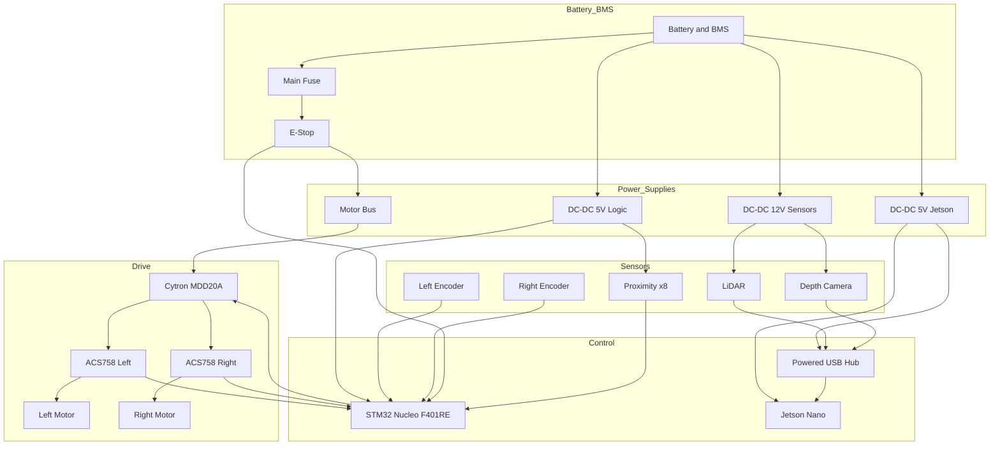

# AMR Hardware Block Diagram

- Components shown reflect `docs/Component_specifications.md`, `docs/wiring_schematic.md`, and `docs/pin_map.yaml`.
- TBD items (battery specs, exact LiDAR/depth/proximity models) can be filled once finalized.
- Diagram groups power, drive, control, and sensors; dashed lines denote optional or sense-only paths.
