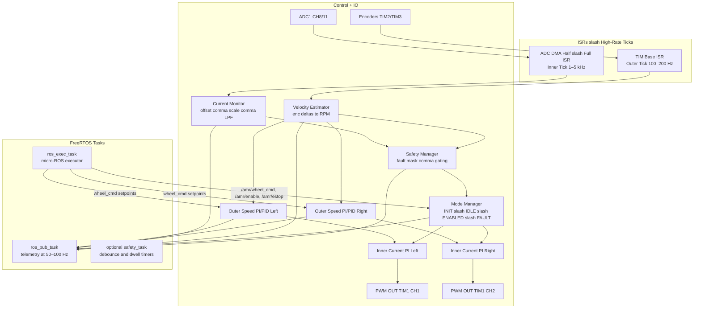
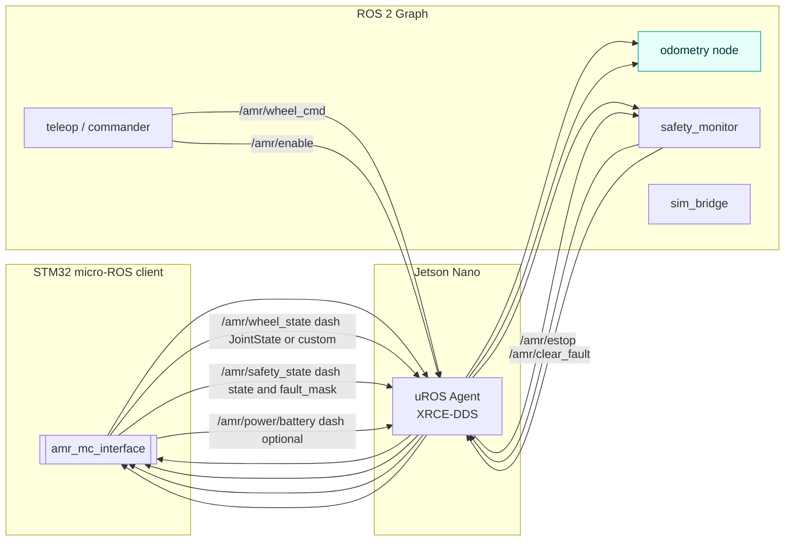

# micro-ROS Integration Architecture

Owner: Kartik Mehta
Status: Draft — aligns with existing motor-control architecture
Last Updated: 2025-11-06

This page shows how micro-ROS sits above the STM32 motor-control firmware. Control loops stay in deterministic ISRs/ticks; micro‑ROS runs in RTOS tasks, exchanging data via mailboxes/queues.

---

## FreeRTOS Tasks and Control Loops

Notes
- ISRs own the time‑critical work; tasks never execute control math directly.
- ROS callbacks write desired state into mailboxes; ticks read atomically.
- Telemetry is decimated to 50–100 Hz in `ros_pub_task`.

---

## ROS Topic Integration MCU to Jetson

Topic and QoS suggestions
- Sub: `/amr/wheel_cmd` dash left right speed or Twist. QoS dash reliable comma volatile. 50–100 Hz or on change.
- Sub: `/amr/estop`, `/amr/enable`, `/amr/clear_fault` dash Bool or Empty or services. Reliable.
- Pub: `/amr/wheel_state` dash JointState or custom best effort comma 50–100 Hz; include `position`, `velocity`, optional `effort` equals current.
- Pub: `/amr/safety_state` reliable comma 10–50 Hz and on change; include `state` enum and `fault_mask`.

Failure handling
- Link loss or agent timeout transitions Mode to IDLE/FAULT after dwell; Safety gates PWM to 0.
- Hardware E‑stop remains primary; topic estop augments it.

---

## Key Principles

- Control math stays in deterministic ticks and ISRs. Tasks do not run control steps.
- ROS I O is an interface layer. It only writes setpoints and reads snapshots.
- Safety has final say. Any unsafe state forces duty to zero through gating.
- Determinism over throughput. Predictable loop timing beats maximum message rate.

## Real Time Boundaries

- Inner loop rate 1 to 5 kHz. Driven by ADC or PWM update. Runs current PI and duty update.
- Outer loop rate 100 to 200 Hz. Driven by base timer. Runs speed PI or PID and updates current reference.
- Telemetry rate 50 to 100 Hz. Downsampled snapshot. No heavy formatting on MCU.

## Data Flow and Ownership

- Callbacks write to mailboxes. No locks on ISRs. Use single writer per field.
- Ticks read a stable copy. Use double buffer or atomic swap on small fields.
- Time tags are produced at source. Include t ms from MCU for each snapshot.

## Topic Map Summary

- Sub wheel cmd. Desired wheel speed or Twist. Reliable. Volatile. Rate 50 to 100 Hz or on change.
- Sub estop. Boolean. Reliable. Treated as software stop. Hardware stop remains primary.
- Sub enable and clear fault. Boolean or service. Reliable.
- Pub wheel state. JointState or custom. Best effort. Velocity and position. Effort can map to current.
- Pub safety state. Reliable. Includes mode state and fault mask. Rate 10 to 50 Hz and on change.

## Tasking and Priorities

- Highest. ISR for inner loop and outer loop. Keep work minimal.
- High. ROS exec task. Only pumps executor and copies small messages into mailboxes.
- Medium. ROS pub task. Builds and publishes snapshots at decimated rate.
- Optional. Safety task. Debounce and dwell timers that are not time critical.

## Failure Handling

- Agent timeout or link loss. Mode transitions to idle or fault after dwell. PWM forced to zero.
- Estop asserted by topic. Treated as fault. Latches until clear request and safe state.
- Sensor faults. Overcurrent, encoder timeout, ADC range. Set fault bits and gate outputs.

## Timing Targets

- Inner loop budget under 30 microseconds for both wheels at 4 kHz.
- Outer loop budget under 500 microseconds at 200 Hz.
- ROS pub build and send under 2 milliseconds at 100 Hz. Use static allocation.

## Resource Budget

- Stack per task sized with headroom. Measure high water marks during test.
- Static memory for ROS messages and executor. Avoid heap churn.
- UART or transport bandwidth sized for worst telemetry. Use binary or compact text when needed.

## Bring Up Order

- Verify ISRs run at expected rates with scope or GPIO toggle.
- Add mailboxes and stub callbacks without acting on commands.
- Enable wheel cmd write to setpoints. Keep gains conservative.
- Add telemetry publish. Validate message fields and rates on agent side.
- Add safety and mode integration. Validate latching and clear flow.

## Tuning and Test Notes

- Start with current limits and slow ramps. Confirm duty clamps and anti windup.
- Validate speed loop against synthetic steps using the Python tools in repo.
- Record baseline logs for single loop and cascaded control. Keep identical test scripts.
