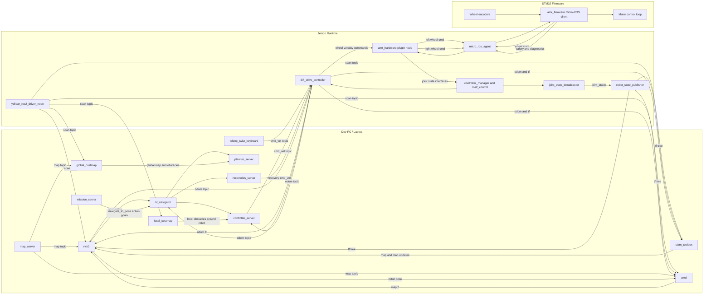
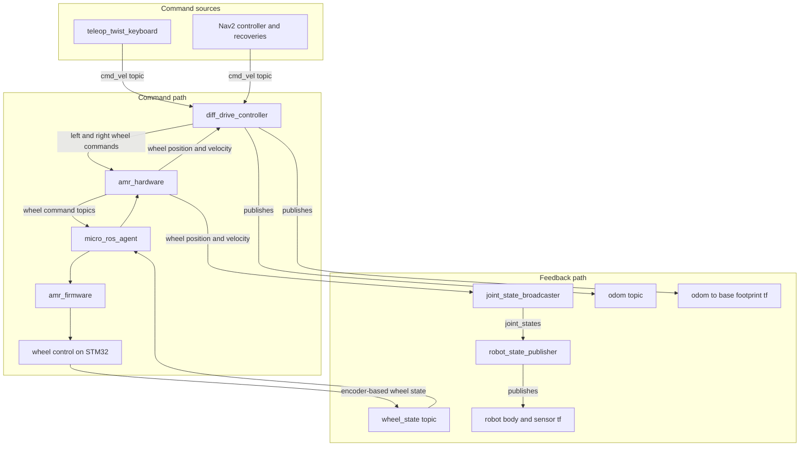
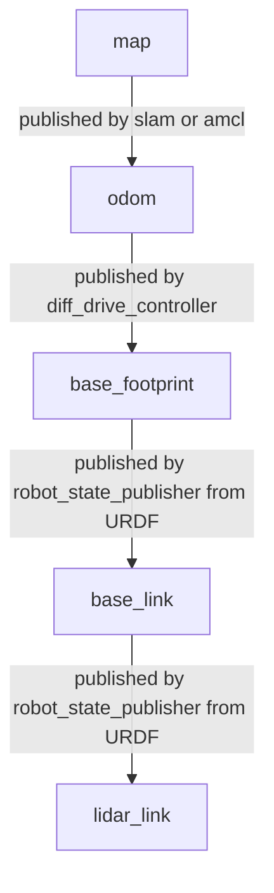
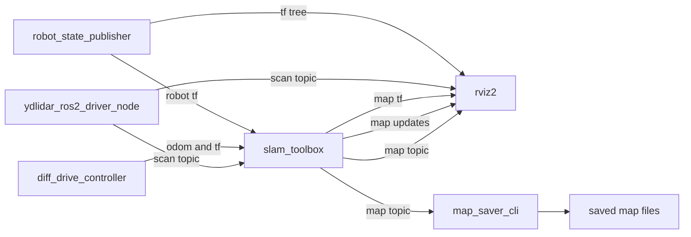
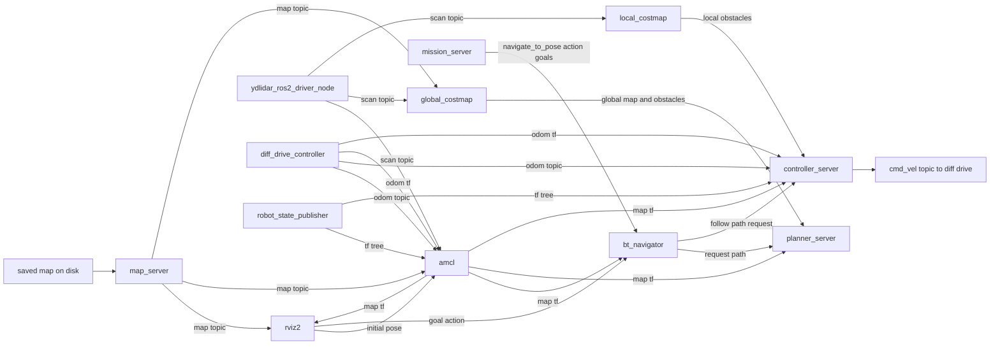
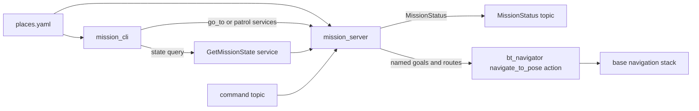

# ROS Stack Diagrams

This document explains the actual ROS 2 graph used in this repo for the real AMR bring-up path, mapping, localization, navigation, and the current persistent mission layer on top of Nav2.

It is based on the current launch files, `ros2_control` config, Nav2 params, and STM32 firmware source, not just the older architecture notes.

## Source of truth

- Jetson hardware bring-up: `ros_ws/src/amr_description/launch/hardware.launch.py`
- Real hardware `ros2_control`: `ros_ws/src/amr_description/urdf/ros2_control.xacro`
- Diff-drive controller config: `ros_ws/src/amr_description/config/ros2_control.yaml`
- SLAM Toolbox config: `ros_ws/src/amr_description/config/slam_toolbox_online_async.yaml`
- Nav2 + AMCL config: `ros_ws/src/amr_description/config/nav2_params_amr.yaml`
- Mission layer package: `ros_ws/src/amr_missions`
- STM32 micro-ROS firmware: `STM/STM_Firmware_AMR_v2/Core/Src/main.c`
- STM32 micro-ROS transport: `STM/STM_Firmware_AMR_v2/Core/Src/dma_transport.c`

## Important note about the motion-command path

Older repo notes mention the STM32 subscribing directly to `/cmd_vel`.

The current real-hardware path in code is different:

- `teleop_twist_keyboard` and Nav2 publish to `/diff_drive_controller/cmd_vel_unstamped`
- `diff_drive_controller` converts base motion into left/right wheel velocity commands
- the `amr_hardware` `ros2_control` plugin publishes:
  - `/amr/wheel_cmd_left`
  - `/amr/wheel_cmd_right`
- the STM32 firmware subscribes to those two wheel-command topics

That is the path shown below.

## 1. Full Real-Hardware ROS Graph

Exact topic names are listed in the topic table below. The diagrams use shorter labels so they render reliably.

## 2. Base Motion And Odometry Path

This is the control path you use first when teleoperating the AMR from the laptop.

### What each piece does

- `teleop_twist_keyboard` publishes base motion commands as a `Twist`.
- `diff_drive_controller` converts that base `Twist` into left and right wheel velocities.
- `amr_hardware` is the bridge between `ros2_control` and the STM32 micro-ROS topics.
- STM32 firmware executes the wheel control loop and publishes wheel state back.
- `diff_drive_controller` uses returned wheel state to produce odometry.
- `joint_state_broadcaster` and `robot_state_publisher` provide the TF tree used by SLAM, AMCL, Nav2, and RViz.

## 3. TF Ownership

The most important thing to understand is who owns each transform.

### Consequence

- During mapping, `slam_toolbox` owns `map -> odom`.
- During localization/navigation, `amcl` owns `map -> odom`.
- `diff_drive_controller` owns `odom -> base_footprint`.
- `robot_state_publisher` owns the robot-body and sensor-link transforms.

This is why `slam_toolbox` and `AMCL` must not run together.

## 4. Mapping Mode With SLAM Toolbox

Use this mode when creating a map.

### SLAM Toolbox consumes

- `/scan`
- TF chain from `map` work backwards through:
  - `odom -> base_footprint`
  - `base_footprint -> ... -> lidar_link`

### SLAM Toolbox produces

- `/map`
- `/map_updates`
- `map -> odom` TF

### Mapping data flow

1. LiDAR publishes `/scan`.
2. The base stack provides odometry and robot/sensor TF.
3. `slam_toolbox` aligns scans over time and builds `/map`.
4. You save the map to disk as `.yaml` and `.pgm`.

## 5. Localization And Navigation Mode

Use this mode after a map already exists on disk.

### What each Nav2 piece does

- `map_server`: loads the saved map and publishes `/map`.
- `amcl`: estimates robot pose in the saved map and publishes `map -> odom`.
- `global_costmap`: combines static map with live obstacle data for planning.
- `planner_server`: computes a path through the global costmap.
- `local_costmap`: tracks local obstacles around the robot using `/scan`.
- `controller_server`: follows the planned path and outputs velocity commands.
- `bt_navigator`: coordinates the whole navigation behavior.
- `recoveries_server`: handles backup, spin, and wait recoveries when needed.

## 6. Mission Layer Over Nav2

The current mission layer does not replace Nav2 planning; it runs as a persistent dev-PC-side runtime that sequences named goals and patrol behavior on top of Nav2.

### Current mission-layer responsibilities

- Load named places from `places.yaml`
- Accept `go_to`, `patrol`, and `cancel` requests over services and topic commands
- Translate `go_to(name)` into a Nav2 `navigate_to_pose` goal
- Support patrol sequencing with retries, timeouts, and optional return-home behavior
- Publish typed mission status and expose current runtime state

### Current named places

- `home`
- `door`
- `kitchen`
- `hall`

### Near-term direction

- Keep `mission_cli` as a thin operator tool
- Keep `mission_server` as the long-running mission runtime next to Nav2 on the dev-PC side
- Add named routes and richer mission supervision
- Add safety-aware abort behavior and tighter integration with higher-level autonomy

## 7. Nav2 Topic Remapping In This Repo

Nav2 normally expects:

- `/cmd_vel`
- `/odom`

This repo remaps them in launch so Nav2 works with the real base:

- `/cmd_vel` -> `/diff_drive_controller/cmd_vel_unstamped`
- `/odom` -> `/diff_drive_controller/odom`

That remap is done in:

- `ros_ws/src/amr_description/launch/bringup_nav2.launch.py`
- `ros_ws/src/amr_description/launch/nav2_navigation.launch.py`

## 8. Exhaustive Topic Ownership

This section is exhaustive for the repo-controlled topics used by the real AMR base, SLAM, localization, navigation, RViz interaction, and STM32 diagnostics.

It does not attempt to enumerate every internal topic, service, or action created inside upstream packages such as Nav2, `slam_toolbox`, `realsense2_camera`, or RViz plugins. For example, the RViz Nav2 Goal tool talks to Nav2 through an action API rather than a normal topic.

### 8.1 Core base-control topics

| Topic | Produced by | Consumed by | Contents |
| --- | --- | --- | --- |
| `/diff_drive_controller/cmd_vel_unstamped` | `teleop_twist_keyboard`, Nav2 controller, Nav2 recoveries | `diff_drive_controller` | `geometry_msgs/Twist` with commanded base linear and angular velocity, mainly `linear.x` and `angular.z` for this differential-drive base |
| `/amr/wheel_cmd_left` | `amr_hardware` | STM32 firmware via `micro_ros_agent` | `std_msgs/Float32` containing commanded left wheel angular velocity in rad/s |
| `/amr/wheel_cmd_right` | `amr_hardware` | STM32 firmware via `micro_ros_agent` | `std_msgs/Float32` containing commanded right wheel angular velocity in rad/s |
| `/amr/wheel_state` | STM32 firmware via `micro_ros_agent` | `amr_hardware` | `sensor_msgs/JointState` with wheel joint names plus wheel position and velocity arrays for left and right wheels |
| `/joint_states` | `joint_state_broadcaster` | `robot_state_publisher`, RViz | `sensor_msgs/JointState` representing the joint-state view exposed by `ros2_control` for the robot model |
| `/diff_drive_controller/odom` | `diff_drive_controller` | `slam_toolbox`, `amcl`, Nav2, RViz | `nav_msgs/Odometry` with robot pose and twist in the odometry frame, derived from wheel feedback |

### 8.2 Safety, enable, and bench-diagnostics topics

These topics are all still intentionally present in the STM firmware. Some are mainly used by monitor and bench-calibration tooling rather than the core Nav2 path, but they remain part of the live firmware topic set and should not be treated as stale or removed from the current documentation.

| Topic | Produced by | Consumed by | Contents |
| --- | --- | --- | --- |
| `/amr/enable` | operator or helper topic publisher | STM32 firmware | `std_msgs/Bool` command indicating whether motion should be enabled |
| `/amr/estop` | operator or helper topic publisher | STM32 firmware | `std_msgs/Bool` command indicating software e-stop state |
| `/amr/clear_fault` | operator or helper topic publisher | STM32 firmware | `std_msgs/Empty` pulse used to request fault reset |
| `/amr/fault_mask` | STM32 firmware via `micro_ros_agent` | operator tools, diagnostics | `std_msgs/Int32` bitmask encoding active or latched faults such as overcurrent, stall, or encoder timeout |
| `/amr/safety_state` | STM32 firmware via `micro_ros_agent` | operator tools, diagnostics | `std_msgs/UInt32` state code summarizing enable, idle, fault, or e-stop related controller state |
| `/amr/duty_cmd_left` | STM32 firmware via `micro_ros_agent` | operator tools, diagnostics | `std_msgs/Float32` reporting applied left motor duty percentage |
| `/amr/duty_cmd_right` | STM32 firmware via `micro_ros_agent` | operator tools, diagnostics | `std_msgs/Float32` reporting applied right motor duty percentage |
| `/amr/current_left_ma` | STM32 firmware via `micro_ros_agent` | operator tools, diagnostics | `std_msgs/Int32` left motor current estimate in milliamps |
| `/amr/current_right_ma` | STM32 firmware via `micro_ros_agent` | operator tools, diagnostics | `std_msgs/Int32` right motor current estimate in milliamps |
| `/amr/current_left_adc` | STM32 firmware via `micro_ros_agent` | operator tools, diagnostics | `std_msgs/UInt32` raw ADC sample for the left current sensor |
| `/amr/current_right_adc` | STM32 firmware via `micro_ros_agent` | operator tools, diagnostics | `std_msgs/UInt32` raw ADC sample for the right current sensor |
| `/amr/current_left_zero` | STM32 firmware via `micro_ros_agent` | operator tools, diagnostics | `std_msgs/UInt32` stored or estimated zero-offset value for the left current sensor |
| `/amr/current_right_zero` | STM32 firmware via `micro_ros_agent` | operator tools, diagnostics | `std_msgs/UInt32` stored or estimated zero-offset value for the right current sensor |

### 8.3 Perception and mapping topics

| Topic | Produced by | Consumed by | Contents |
| --- | --- | --- | --- |
| `/scan` | `ydlidar_ros2_driver_node` | `slam_toolbox`, `amcl`, Nav2 costmaps, RViz | `sensor_msgs/LaserScan` with per-angle ranges and scan timing in the LiDAR frame |
| `/map` | `slam_toolbox` in mapping mode, `map_server` in localization/navigation mode | RViz, `amcl`, Nav2 global costmap, `map_saver_cli` | `nav_msgs/OccupancyGrid` with map metadata like resolution, width, height, origin, and the occupancy data array |
| `/map_updates` | `slam_toolbox` | RViz | Incremental occupancy-grid update messages describing changed regions of the map since the last full map |

### 8.4 RViz interaction topics

| Topic | Produced by | Consumed by | Contents |
| --- | --- | --- | --- |
| `/initialpose` | RViz Set Initial Pose tool | `amcl` | `geometry_msgs/PoseWithCovarianceStamped` representing the user's estimated starting pose on the map |
| `/clicked_point` | RViz Publish Point tool | user tools or debug scripts | `geometry_msgs/PointStamped` containing a user-clicked 3D point in the current fixed frame |
| `/robot_description` | robot-description source used by `robot_state_publisher` and exposed to RViz | RViz RobotModel display | URDF XML string describing the robot links, joints, visuals, and fixed sensor placements |

### 8.5 Navigation-support topics explicitly configured in this repo

| Topic | Produced by | Consumed by | Contents |
| --- | --- | --- | --- |
| `local_costmap/costmap_raw` | Nav2 local costmap | `recoveries_server` | Local obstacle costmap grid around the robot before RViz-style display processing |
| `local_costmap/published_footprint` | Nav2 local costmap | `recoveries_server` | Robot footprint polygon currently being used in the local costmap |

### 8.6 Transform topics

| Topic | Produced by | Consumed by | Contents |
| --- | --- | --- | --- |
| `/tf` | `robot_state_publisher`, `diff_drive_controller`, `slam_toolbox` or `amcl` | SLAM, localization, Nav2, RViz | `tf2_msgs/TFMessage` containing one or more time-stamped dynamic transforms between parent and child frames |
| `/tf_static` | `robot_state_publisher` | SLAM, localization, Nav2, RViz | `tf2_msgs/TFMessage` containing latched static transforms for fixed parent-child frame pairs |

### 8.7 Named transforms carried on `/tf` or `/tf_static`

| Transform | Published on | Produced by | Consumed by | Contents |
| --- | --- | --- | --- | --- |
| `map -> odom` | `/tf` | `slam_toolbox` during mapping, `amcl` during localization/navigation | RViz, Nav2, localization stack | Translation and rotation that align the drifting `odom` frame to the fixed global `map` frame |
| `odom -> base_footprint` | `/tf` | `diff_drive_controller` | `slam_toolbox`, `amcl`, Nav2, RViz | Translation and rotation giving the robot base pose in the odometry frame from wheel odometry |
| `base_footprint -> base_link` | usually `/tf_static` | `robot_state_publisher` | SLAM, localization, Nav2, RViz | Fixed rigid-body transform between the floor-projected base frame and the robot body frame |
| `base_link -> lidar_link` | usually `/tf_static` | `robot_state_publisher` | `ydlidar_ros2_driver_node`, `slam_toolbox`, RViz | Fixed LiDAR mounting offset and orientation relative to the robot body |
| `base_link -> camera_link` | usually `/tf_static` | `robot_state_publisher` | optional camera stack, RViz | Fixed camera mounting offset and orientation relative to the robot body |

### 8.8 Optional topics not expanded in detail here

- Optional RealSense bring-up publishes a larger `/camera/*` and point-cloud topic set through `realsense2_camera`.
- Those topics are not part of the current base teleop, SLAM, AMCL, and Nav2 loop, so they are intentionally not expanded in the tables above.

## 9. What `/tf`, `/tf_static`, `map -> odom`, and `odom -> base_footprint` Mean

### `/tf`

`/tf` is not one transform. It is the ROS topic that carries dynamic transforms, meaning transforms that may change over time.

In this repo, the most important transforms on `/tf` are:

- `odom -> base_footprint` from `diff_drive_controller`
- `map -> odom` from `slam_toolbox` during mapping
- `map -> odom` from `amcl` during localization/navigation
- dynamic link transforms from `robot_state_publisher` when joint states change

You can think of `/tf` as the live pose stream for the robot and its moving parts.

### `/tf_static`

`/tf_static` carries transforms that do not change during operation.

In this repo, `robot_state_publisher` uses the URDF to publish fixed geometry such as:

- `base_footprint -> base_link`
- `base_link -> lidar_link`
- `base_link -> camera_link`
- other rigid chassis and sensor-link relationships

These are latched static transforms, so new subscribers can immediately get them without waiting for them to be republished continuously.

### `map -> odom`

`map -> odom` is the global correction transform.

Why it exists:

- the `odom` frame comes from wheel odometry
- wheel odometry is smooth and continuous
- but wheel odometry drifts over time
- the `map` frame is the globally consistent frame tied to the actual environment map

So `map -> odom` is the correction that aligns the drifting odometry frame with the fixed map frame.

Ownership in this repo:

- during mapping, `slam_toolbox` publishes `map -> odom`
- during localization/navigation, `amcl` publishes `map -> odom`

This is why you must not run `slam_toolbox` and `amcl` at the same time. They would both try to own the same transform.

### `odom -> base_footprint`

`odom -> base_footprint` is the local motion estimate of the robot from wheel odometry.

In this repo:

- `diff_drive_controller` computes it from wheel feedback coming from `/amr/wheel_state`
- it publishes both the transform and the odometry message on `/diff_drive_controller/odom`

Properties of this transform:

- smooth
- continuous
- good for short-term local control
- drifts over time because it is based on encoders only

### Why there are two levels instead of one

The frame chain is:

- `map -> odom -> base_footprint -> base_link -> lidar_link`

Each part has a different job:

- `map -> odom`: global correction
- `odom -> base_footprint`: local wheel-based motion
- `base_footprint -> base_link -> sensor links`: robot geometry from the URDF

This split is very important because Nav2 and SLAM want both:

- a smooth local frame for control and scan matching
- a globally corrected frame for map alignment and navigation goals

### Practical mental model

If the robot moves 1 meter forward:

- `odom -> base_footprint` changes immediately based on encoder motion
- over time that odometry may drift a little
- `slam_toolbox` or `amcl` adjusts `map -> odom` so the robot still lines up with the actual map

That is the reason the robot can have smooth local motion and still remain globally aligned with the saved map.

## 9. Where Topics Are Generated In Practice

### Jetson-side bring-up

Started by `hardware.launch.py`:

- `micro_ros_agent`
- YDLidar driver
- `robot_state_publisher`
- `ros2_control_node`
- `joint_state_broadcaster`
- `diff_drive_controller`

### STM32-side micro-ROS topics

Current firmware publishes:

- `/amr/wheel_state`
- `/amr/fault_mask`
- `/amr/safety_state`
- `/amr/duty_cmd_left`
- `/amr/duty_cmd_right`
- `/amr/current_left_ma`
- `/amr/current_right_ma`
- `/amr/current_left_adc`
- `/amr/current_right_adc`
- `/amr/current_left_zero`
- `/amr/current_right_zero`

Current firmware subscribes to:

- `/amr/wheel_cmd_left`
- `/amr/wheel_cmd_right`
- `/amr/enable`
- `/amr/estop`
- `/amr/clear_fault`

## 10. Mental Model

The stack is easiest to understand in layers:

1. Sensors and MCU produce raw robot state:
   - `/scan`
   - `/amr/wheel_state`
   - safety and current topics
2. `ros2_control` turns wheel state into robot motion interfaces:
   - accepts base velocity commands
   - computes odometry
   - publishes `/diff_drive_controller/odom`
3. TF makes the robot spatially coherent:
   - `odom -> base_footprint` from diff-drive
   - body and sensor frames from `robot_state_publisher`
4. Mapping or localization adds global pose:
   - `slam_toolbox` during mapping
   - `amcl` during localization
5. Nav2 closes the loop:
   - plan on `/map`
   - avoid obstacles from `/scan`
   - output base motion back into `diff_drive_controller`

## 11. One-line summary

For this repo, the practical closed loop is:

`teleop or Nav2 -> /diff_drive_controller/cmd_vel_unstamped -> diff_drive_controller -> amr_hardware -> /amr/wheel_cmd_left/right -> STM32 -> /amr/wheel_state -> amr_hardware -> diff_drive_controller -> /diff_drive_controller/odom -> SLAM or AMCL -> map-aware RViz/Nav2`
