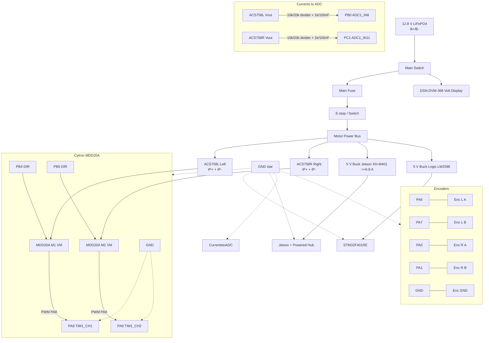

# AMR Wiring and Power Schematic (Text Overview)

This document captures the practical wiring plan for the AMR project: power distribution, E-stop, and signal interconnects between the STM32 controller, motor driver, encoders, Jetson Nano, and sensors. Pin mapping is authoritative in `docs/pin_map.yaml`.

---

## 1) Power Distribution

- Battery: 12.8 V LiFePO4 4S, 18 Ah (pack has basic internal BMS)
  - Main Fuse: size for expected peak (e.g., 30-40 A slow-blow for current drivetrain; revisit after measurements)
  - Main switch to cut all rails (upstream of fuse/E-stop); E-stop contactor in motor path (see E-stop section)
  - Branches:
    - Motor Power Bus + Motor Driver VM (Cytron MDD20A)
    - DC-DC Buck 5 V (Jetson Nano, USB hub) — XH-M401 / XL4016 class
    - DC-DC Buck 5 V/12 V for sensors (LiDAR, depth cam, CS100A proximity) — LM2596 for 5 V logic rail; 12 V optional if needed
  - Battery voltage display (DSN-DVM-368) fed after main switch so it is off when the robot is off

Notes
- Use star ground: join motor return, STM32 GND, Jetson GND, and sensor grounds at a solid common point.
- Size DC-DC modules with margin (Jetson Nano can draw 3-4 A peak on 5 V; depth cameras and LiDAR add significant load).
- Keep motor currents off the logic 5 V/3.3 V rails; separate power domains that meet at ground.

### 1a) Power Distribution Details
- Battery Pack: 12.8 V LiFePO4 4S 18 Ah with internal basic BMS. Outputs raw pack voltage; no regulated 5 V/12 V and limited telemetry.
- DC-DC 5 V Jetson: dedicated 5 V buck with ~6-8 A continuous (e.g., Mean Well RSD-60G-5 wide-input or equivalent). Powers Jetson Nano and powered USB hub.
- DC-DC 5 V Logic: 5 V supply for STM32 board and proximity sensors (1-2 A typical). Can share with Jetson rail if capacity and noise allow; otherwise isolate.
- DC-DC 12 V Sensors (optional): only if any sensor requires 12 V; otherwise omit.

Voltage monitoring (optional)
- Add a resistive divider from pack P+/P- to an ADC input (on STM32 or a small monitor) to estimate state of charge and low-voltage cutoff warnings. Choose values to keep ADC input under 3.3 V at 14.6 V full charge.
- Optional panel display: DSN-DVM/DUM-368 wired after the main switch across pack P+/P- for at-a-glance pack voltage; goes dark when the main switch is off (2-wire variant is self-powered; 3-wire adds separate sense lead).

Wiring intent
- Battery/BMS + Main Fuse + E-stop + Motor Power Bus + Motor driver VM.
- Battery/BMS + DC-DC 5 V Jetson (XH-M401) + Jetson Nano, USB hub.
- Battery/BMS + DC-DC 5 V Logic (LM2596) + STM32, proximity sensors.
- Battery/BMS + DC-DC 12 V Sensors + 12 V sensors (if used).

---

## 1b) Current Sensor Wiring (ACS758LCB-050B)

- Placement: One module per motor supply line; wire IP+ and IP- in series with each wheel feed.
- Power: Vcc = 5 V; GND common with STM32. Add 0.1 uF decoupling at the sensor.
- Sense output: Vout into a 10 kOhm top resistor and 20 kOhm bottom to GND; tap the midpoint to ADC (PB0 left, PC1 right). Divider ratio is 20k / (10k+20k) ~ 0.667 so 0-5 V from the sensor becomes ~0-3.33 V at the ADC.
- Filter: Add 1 kOhm series plus 100 nF to GND after the divider to reduce PWM ripple.
- Layout: Keep the IP+/IP- loop short and away from signal wiring; route Vout away from motor leads.

---

## 1c) Wiring Diagram (text/mermaid overview)

Notes
- Insert one ACS758 per wheel supply. Keep IP+/IP- loops short. Route Vout away from motor leads.
- Jetson/hub on dedicated high-current 5 V buck. Logic on separate 5 V buck or shared if capacity/noise is acceptable.
- All grounds meet at a solid star point near the power entry.

---

## 1d) Wire Gauge Guidance (initial sizing)

- Battery + Fuse + E-stop + Motor driver VM/GND: AWG 12-14, keep short and well-crimped.
- Motor driver + Motors (each channel): AWG 14-16 depending on run length and expected current; shorter runs can use 16.
- DC-DC 5 V Jetson rail: AWG 16-18 from buck to Jetson/hub to minimize drop; use quality connectors.
- DC-DC 5 V Logic rail: AWG 20-22 (STM32 and light sensors).
- Encoder A/B and logic signals: AWG 24-26 twisted pair with ground return; optionally shield if noisy.
- Sensor USB cables: use powered hub for LiDAR/RealSense; keep USB leads short and rated for current.
- Grounds: implement star point with the same gauge as the largest branch it serves (typically match the supply feed gauge).

Notes
- If measured peaks exceed assumptions, upsize the affected runs one gauge thicker.
- Keep high-current runs separated from encoder and ADC wiring; cross at right angles when needed.

---

## 2) Emergency Stop (E-stop)

- Primary action: Hardware cut of Motor Power Bus feeding the motor driver VM input.
  - Option A: Latching E-stop switch in series with motor supply (simplest).
  - Option B: E-stop switch drives a relay/contactor or high-side switch that disconnects VM.
- Secondary action: STM32 reads E-stop state on a GPIO input to report and latch a software fault (PWM forced to 0 until manual clear).
- Do not rely solely on software for E-stop.

Wiring summary
- E-stop switch in series with motor supply to Cytron MDD20A VM.
- E-stop sense line + STM32 GPIO (with pull-up/down as appropriate). Debounce in hardware and/or firmware.

---

## 3) STM32 + Motor Driver (Cytron MDD20A)

Cytron MDD20A dual channel driver is the active configuration. Connections are simple PWM plus DIR lines per channel. Keep motor supply routed through fuse and E-stop before entering the VM pin.

### Signal wiring
- PWM: `PA8 TIM1_CH1` + `M1 PWM` left wheel. `PA9 TIM1_CH2` + `M2 PWM` right wheel.
- Direction: `PB4` + `M1 DIR` left. `PB5` + `M2 DIR` right.
- Ground: Tie STM32 ground to driver logic ground close to the driver header.
- Optional brake or coast pins can stay tied per driver manual until firmware exposes those modes.

### Power wiring
- Motor power: Battery or pack output + Fuse + E-stop + Cytron MDD20A `VM`.
- Logic power: Driver logic shares ground with STM32 and is driven by the PWM and DIR inputs (no extra 5 V logic supply pin).
- Ensure motor returns and logic returns join at a solid point to avoid injecting noise into ADC grounds.

### Timing targets
- Set TIM1 prescaler plus ARR for roughly 20 kHz PWM. Higher frequencies reduce audible whine but watch driver thermal behavior.
- Keep duty updates synchronized with the inner current loop so left and right channels stay matched.

---

## 4) Encoders + STM32 (HN3806-AB-600N, open-collector)

- Signals: A, B (quadrature). Index Z if used (optional, not required for speed control).
- Voltage: 5-24 V supply supported by encoder; outputs are NPN open-collector.
- Interface to MCU:
  - Provide external pull-ups to 3.3 V on A and B (e.g., 4.7-10 kOhm).
  - Left wheel: A -> `PA6 (TIM3_CH1)`, B -> `PA7 (TIM3_CH2)` (TIM3 encoder mode).
  - Right wheel: A -> `PA0 (TIM2_CH1/ETR)`, B -> `PA1 (TIM2_CH2)` (TIM2 encoder mode).
  - Common ground between encoders and STM32.
- Filtering: Enable digital filters on TIM2/TIM3 inputs (CubeMX IC filter <= 10) to reject noise.
- Mounting: Post-gearbox (wheel/output shaft) — confirmed.
- COUNTS_PER_REV: 600 PPR * 4 = 2400 counts per wheel revolution.
  - If remounted pre-gearbox (motor shaft) with 30:1 ratio: 2400 * 30 = 72,000 counts per wheel rev (update firmware accordingly).

---

## 5) STM32 + Jetson Nano

Data link options
- UART (3.3 V TTL): STM32 `USART2 TX (PA2)` + Jetson `UART RX` (J41 pin 10), STM32 `USART2 RX (PA3)` + Jetson `UART TX` (J41 pin 8). GND common.
- USB: Use ST-LINK USB serial or dedicated USB-UART adapter to Jetson USB.

Power (Jetson)
- Provide dedicated 5 V rail with sufficient current (target ~6-8 A to cover Jetson plus USB peripherals). Power Jetson via 5 V header or barrel jack per NVIDIA guidance; keep harness short and low resistance.

---

## 6) Sensors + Jetson (typical)

- LiDAR (YDLidar G4): USB (USB-to-UART) to Jetson via powered USB hub; 5 V power from sensor/USB rail (budget ~0.5 A nominal; confirm peaks). Keep cable short; ensure stable 5 V.
- Depth Camera (Intel RealSense D455): USB 3.x (Type-C cable) to Jetson (prefer powered hub if multiple devices). Power from USB 5 V; ensure USB 3 bandwidth.
- Proximity Sensors: 4x CS100A ultrasonic to STM32 (trigger/echo). Keep wiring short; avoid firing multiple sensors simultaneously to reduce crosstalk; use 3.3 V-compatible echo or level-shift if echo drives 5 V.

Notes
- Use powered USB hub if multiple high-draw USB devices are attached.
- Keep sensor grounds tied to the logic ground.

---

## 7) Proximity Sensors + STM32 (4x CS100A Ultrasonic)

Goal: Obstruction detection around the AMR perimeter using 4 CS100A ultrasonic sensors mounted near corners/edges.

Interface and pin map (STM32 3.3 V GPIO):
- S1 front_left: TRIG -> PC0, ECHO -> PA10 (level shift/divider on echo if 5 V)
- S2 front_right: TRIG -> PC2, ECHO -> PA11 (level shift/divider on echo if 5 V)
- S3 rear_left: TRIG -> PC3, ECHO -> PA12 (level shift/divider on echo if 5 V)
- S4 rear_right: TRIG -> PB10, ECHO -> PA15 (level shift/divider on echo if 5 V)

Timing
- Stagger triggers (round-robin) to avoid crosstalk; add minimal dead time between pings.

Power
- 5 V supply from logic rail; decouple each module (0.1 uF + 10 uF); tie grounds to logic ground.

Firmware notes
- Round-robin firing, timeout for no-echo, median/low-pass filtering; publish via `/amr/obstacles` (e.g., sensor_msgs/Range[]).

---

## 8) Current Sensing (ACS758, both motors)

Goal: Measure per-motor current for protection, logging, and control.

Hardware
- Sensor: ACS758 (variant TBD per current range) installed in series with each motor power line (left/right).
- Supply: 5.0 V recommended; output is ratiometric (~Vcc/2 at 0 A).
- Output conditioning to STM32 ADC:
  - Resistor divider: 10 kOhm (top) + 20 kOhm (bottom) -> scales 0-5 V to ~0-3.33 V (see `docs/pin_map.yaml`).
  - RC filter: 1 kOhm series + 100 nF to ground after divider (fc ~1.6 kHz) to reduce PWM ripple/EMI.
  - ADC pins: `PB0 / ADC1_IN8` (Left current), `PC1 / ADC1_IN11` (Right current).
  - Sampling: ADC1 with DMA in circular mode for periodic current reads.
- Decoupling: 0.1 uF ceramic close to ACS758 Vcc; follow datasheet layout guidance.
- Grounding: Star-point ground; keep sensor Vout return clean and away from high di/dt loops.

Calibration and math
- Zero offset (at 0 A): ~Vcc/2 at sensor output; after divider ~0.667 * (Vcc/2) ~ Vcc/3 (~1.67 V when Vcc=5 V).
- Sensitivity (mV/A): depends on variant (e.g., ~40 mV/A for +/-50 A). Confirm actual part; ADC sees ~26.7 mV/A after the 0.667 divider.
- Formula (at sensor output): I[A] = (Vout - Vcc/2) / Sensitivity.
- With divider (ratio ~0.667): I[A] = ((Vadc/0.667) - Vcc/2) / Sensitivity.
- Firmware should estimate Vcc (5 V) or measure the ADC reference to compensate ratiometric behavior.

Safety and layout
- Size conductors for expected peak current; ensure secure mechanical mounting and insulation.
- Route high-current paths short and tight; keep analog lines separated from PWM motor traces.
- Verify polarity/orientation per ACS758 datasheet so that positive current matches expected sign.

---

## 9) Quick Connector Summary

- STM32 (Nucleo-F401RE pinout references):
  - `PA8 / TIM1_CH1` + PWM Left (M1)
  - `PA9 / TIM1_CH2` + PWM Right (M2)
  - `PB4` + DIR Left (M1), `PB5` + DIR Right (M2)
  - `PA6/PA7 / TIM3` + Left encoder A/B
  - `PA0/PA1 / TIM2` + Right encoder A/B
  - `PB0 / ADC1_IN8` + Left motor current (ACS758)
  - `PC1 / ADC1_IN11` + Right motor current (ACS758)
  - `PA2/PA3` + UART2 TX/RX to Jetson (optional)
  - `PA5` + Status LED
- Motor Driver:
  - Cytron MDD20A terminals: M1 PWM, M1 DIR, M2 PWM, M2 DIR, VM, GND, Motor outputs
- Encoder: A, B, V+, GND (open-collector outputs with 3.3 V pull-ups)
- Proximity Sensors (x4 CS100A): V+, GND, TRIG, ECHO to STM32 GPIOs (echo level-shift to 3.3 V if needed)
- Jetson Nano: 5 V, GND, USB ports, J41 UART if used
- YDLidar G4 / RealSense D455: USB to Jetson via powered hub; 5 V from sensor/USB rail
 - Proximity: Trigger/Echo GPIO (see mapping above)

---

## 10) Layout and EMI Tips

- Keep motor and driver wiring away from encoder and logic wiring; cross at 90 degrees when needed.
- Twist encoder A/B with ground return; shield if available.
- Use proper ferrules and strain relief; avoid loose connectors near moving parts.
- Verify polarity before powering; bring-up with current-limited supply when possible.
